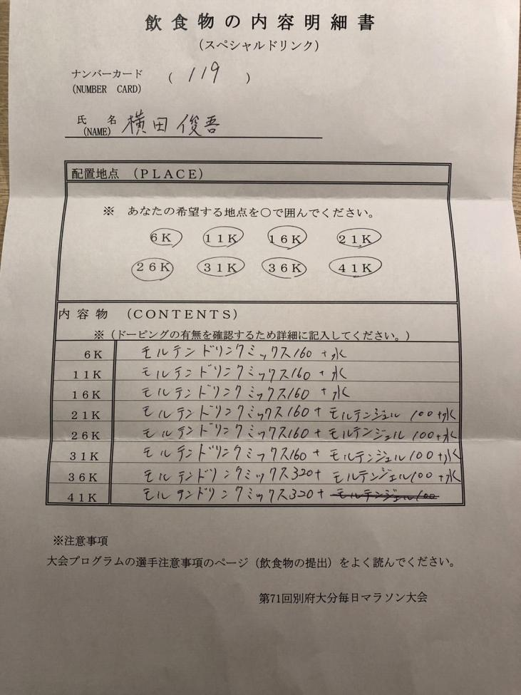
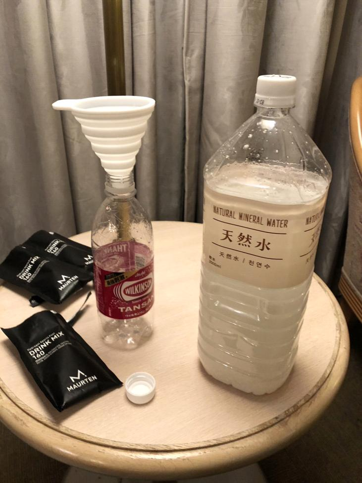
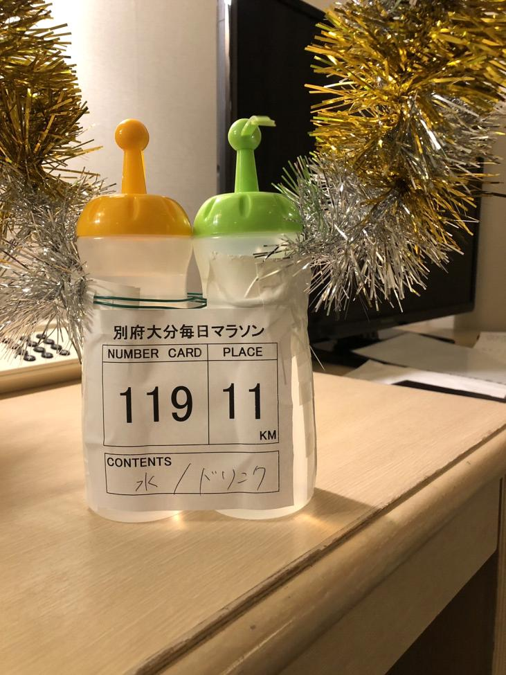
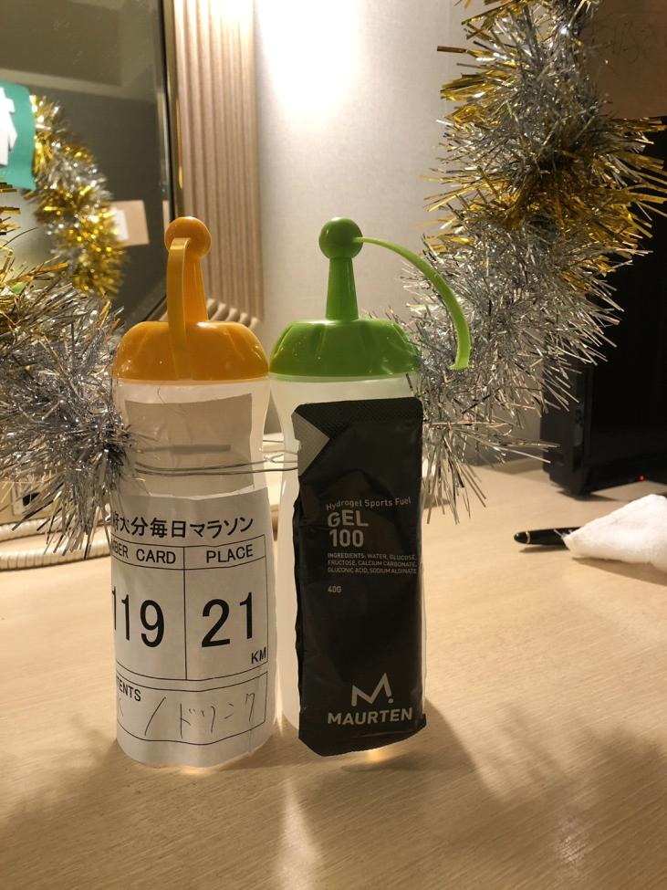
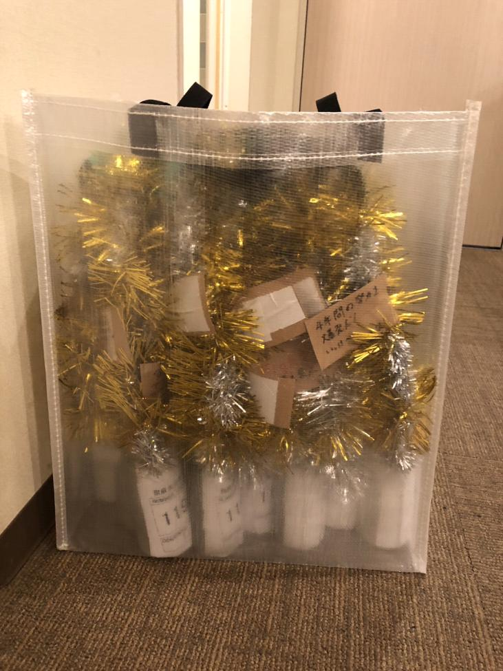

# マラソン準備

## スペシャルドリンクについて

> 💡 **用語解説: スペシャルドリンクとは**
> マラソンなどの長距離レースで、給水所とは別にチームが選手ごとに専用調合して用意する飲料。日本の主要マラソン大会では概ね5kmおきに設置が認められている。エネルギー補給とペース維持のため、糖質濃度や量を選手・区間ごとに計算して準備する。

> 💡 **用語解説: モルテン(Maurten)**
> スウェーデン発のスポーツ栄養ブランド。水を含むとゲル状になる独自のハイドロゲル技術で、胃腸への負担を抑えながら高濃度の糖質を摂取できるのが特徴。ドリンクミックス(粉末)とジェル(ゲル状補給食)がある。

> 💡 **基礎知識: ハイドロゲル技術の仕組み**
> モルテンの粉末には海藻由来のアルギン酸とペクチンが含まれており、胃の中の酸性環境(pH)と反応してゲル状のカプセルを形成する。糖質をこのゲルで包み込むことで、胃から急速に小腸へ移動する高濃度の糖液が引き起こす「浸透圧性下痢」や胃もたれを起こしにくくしている。ゲルが小腸に届くと、そこでは酸性環境がなくなるため再び分解され、糖質が吸収される仕組み。

> 💡 **基礎知識: なぜ「30km/35kmの壁」が起きるのか**
> 体内に貯蔵できる糖質(グリコーゲン)は肝臓に約80〜100g、筋肉に約300〜400g程度と限りがある。マラソンペースで走り続けると、この貯蔵量はおよそ2時間半〜3時間前後(距離にして30〜35km相当)で枯渇し始める。グリコーゲンが枯渇すると、体は主なエネルギー源を脂肪代謝に切り替えざるを得なくなるが、脂肪からのエネルギー産生は糖質に比べて反応速度が遅く、同じ強度を維持できなくなる(急激な失速)。レース終盤に補給量を増やす設計は、この生理的な限界を先送りするための対策。

### 2023年大分毎日マラソン 横田選手の例

| 給水地点 | 内容 |
| --- | --- |
| 6K | モルテンドリンクミックス160 + 水 |
| 11K | モルテンドリンクミックス160 + 水 |
| 16K | モルテンドリンクミックス160 + 水 |
| 21K | モルテンドリンクミックス160 + モルテンジェル100 + 水 |
| 26K | モルテンドリンクミックス160 + モルテンジェル100 + 水 |
| 31K | モルテンドリンクミックス160 + モルテンジェル100 + 水 |
| 36K | モルテンドリンクミックス320 + モルテンジェル100 + 水 |
| 41K | モルテンドリンクミックス320 + 水 |

レース後半(36K以降)にドリンクミックスの量を160→320に増やし、エネルギー切れ(いわゆる「30km/35kmの壁」)を防ぐ設計になっている。

### 糖質濃度の考え方

> 💡 **用語解説: 糖質濃度と胃腸負担の関係**
> 飲料中の糖質濃度が高すぎると、体内に吸収されるまでに時間がかかり、レース中の胃もたれ・下痢の原因になりやすい。一般的に運動中に胃腸で吸収しやすい濃度の目安は6〜8%程度とされる。モルテンはハイドロゲル技術によりこの目安より高濃度でも吸収負担を抑えられる点が特長。

> 💡 **基礎知識: 糖質の種類を混ぜる理由(マルチプルトランスポータブルカーボ)**
> 小腸で糖質を吸収する輸送体(トランスポーター)は種類ごとに上限がある。ブドウ糖(グルコース)は主にSGLT1という輸送体で、果糖(フルクトース)は主にGLUT5という別の輸送体で吸収される。グルコースだけを大量に摂ると1つの輸送体に負荷が集中し吸収しきれず腸に残るが、グルコースと果糖を組み合わせることで2つの輸送体を同時に使え、結果として1時間あたりに吸収・利用できる糖質の総量を増やせる(目安として単一の糖質なら1時間60g程度が上限だが、組み合わせることで90g程度まで引き上げられるとされる)。長時間・高強度のレースで補給量を増やせるのはこの原理を応用している。

- モルテンドリンクミックス160: 500mlあたり糖質39g(濃度約8%)
- モルテンドリンクミックス320: 500mlあたり糖質79g(濃度約16%)
- モルテンジェル100: 100gあたり糖質25g(濃度約25%)

### 一般的なスポーツドリンク

- アクエリアス: 100mlあたり糖質4.6g(濃度約4.6%)
- ポカリスエット: 100mlあたり糖質6.2g(濃度約6.2%)
- ポカリスエット イオンウォーター: 100mlあたり糖質2.7g(濃度約2.7%)

> 💡 市販のスポーツドリンクは糖質濃度3〜6%程度に収まっており、運動中の胃腸吸収に適した6〜8%の目安の範囲内〜やや低めに設計されている。モルテンドリンクミックス(濃度約8〜16%)はこれより明らかに高濃度だが、ハイドロゲル技術によって吸収負担を抑えている。

### 準備物リスト

- [ ] モルテンドリンクミックス160: 4袋
- [ ] モルテンドリンクミックス320: 1袋
- [ ] モルテンジェル100: 4個
- [ ] 水: 6リットル
- [ ] ロート(漏斗)
- [ ] 500mlペットボトル(給水地点の数だけ)

> ⚠️ ボトル提出時にジェルの封を事前に開けておくこと(レース中に選手が自分で開封する手間・時間ロスを防ぐため)。

## マラソン心得

### スタート

- スタートは左にポジションを取る
- スタートは2列目あたりを取るとスタート後走りやすい
- ワセリン(股・脇・乳首)をしっかり塗る。汗が乾いて擦れると痛くなる
- アップ前にコアの刺激入れをしっかりめに行う
- 基本のアップはいつも通り
- スタート前に5-5-5呼吸法を行う
- 肩に力が入らないように筋弛緩法を行う

### 給水

- 給水1キロ前から気持ちの準備をする
- ドリンクを取りに行く前に手を挙げると譲ってもらえる
- ドリンクは取ってからすぐに飲まず、少し走ってリズムを整えてから飲む。先頭ランナーが給水を取りに行くタイミングでペースアップが起きるため、すぐに飲んでしまうと気づいた時には先頭が離れていて、追いつくためにペースを上げないといけなくなることがある(例: 2:45まで上げる必要が出るなど)
- 21キロからはゼリーを取ること
- ゼリーを取ってからドリンクを飲むのが良い。ゼリーを飲んだ後にドリンクを飲みたい場合はドリンクを運ぶ必要があるため、輪っかに腕を通して走りながらゼリーを飲み、その後ドリンクを飲む。そのため21キロ以降はドリンクを少なめにしておくとよい
- 最初の6キロは給水ボトルにメッセージカードをつけない(転倒の恐れがあるため)。視野を広く、周りを見ながら取る。最悪誰かに譲ってもらえば良いという気持ちでいること
- 輪っかの見やすさは重要。取りやすくなる

### レースプラン

- 30キロまでは第一集団後方につく
- 位置取りが上手く、無駄な動きをしないランナーを見つけて後ろにつく。自分自身もできるだけ無駄な動きをしないこと
- 下りはペースが上がるので気持ちを入れる
- 30キロまではペース走だと思うこと
- 38キロからは気持ち
- 筋肉が痙攣しても、みんな痙攣しているから大丈夫
- 垂れる(ペースが落ちる)と楽になるタイミングがある。楽になっていることに早く気づけるかがポイント
- 給水の後に肩の筋弛緩法をサクッと行う。意外と知らないうちに力んでいる

### 準備

- コアの強化(30分程度のトレーニングでは足りない)
- 前日刺激は2:55前後で良い

## スペシャルドリンク準備の実例写真

