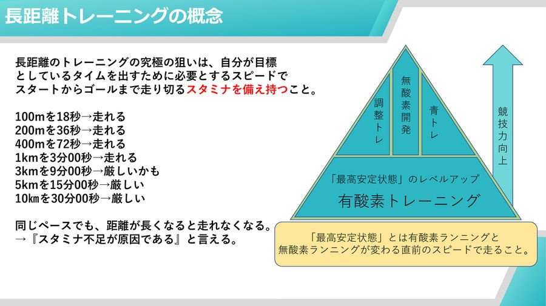
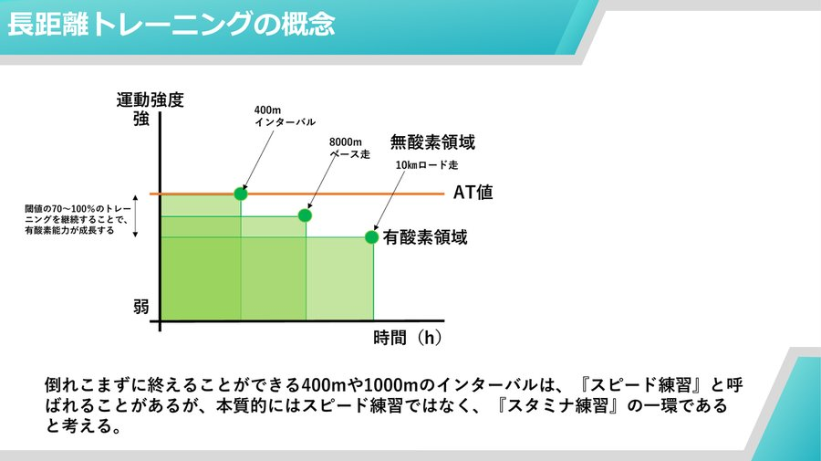
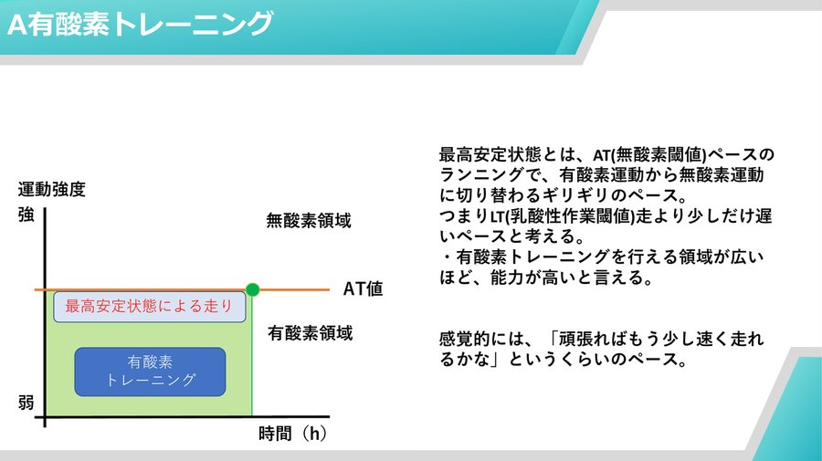
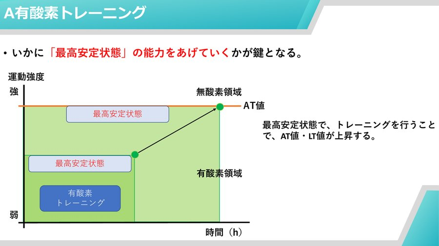
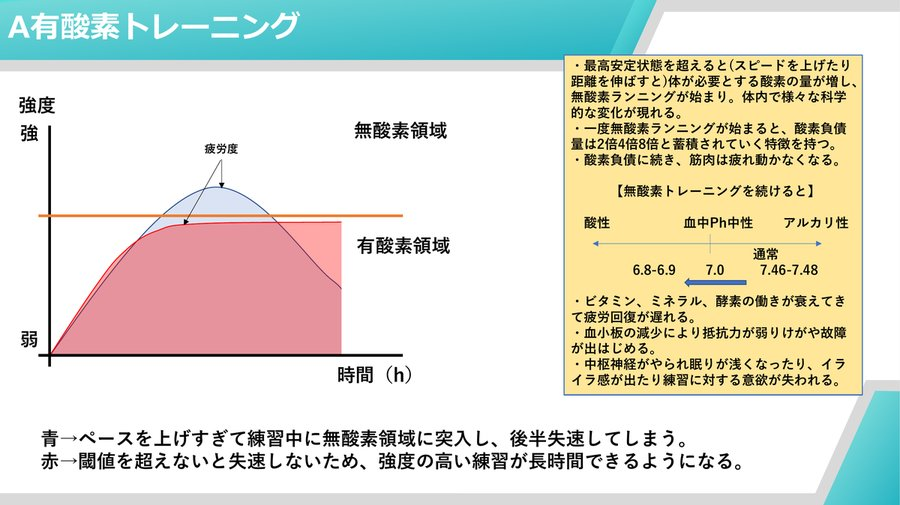
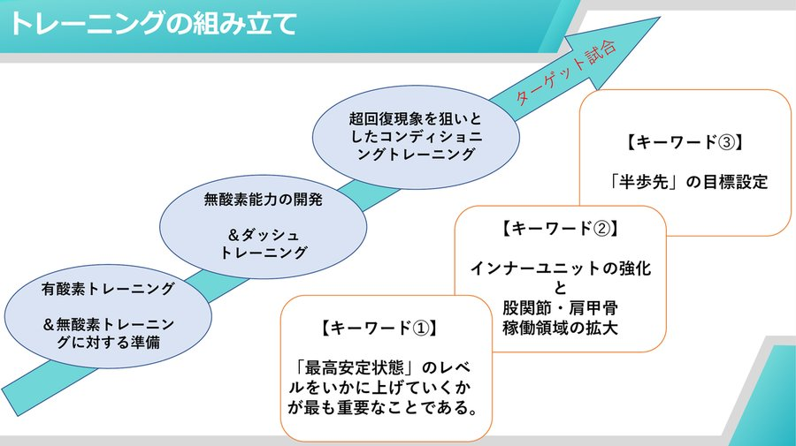
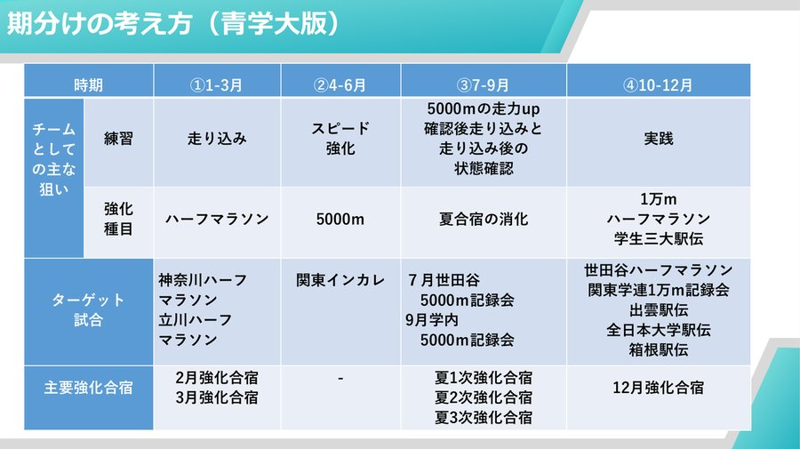
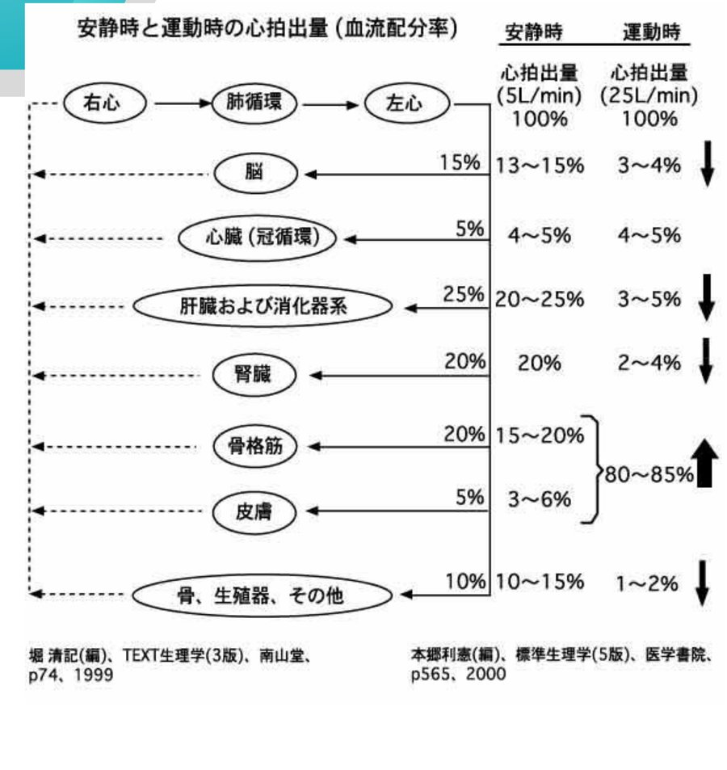

# 青学メソッド

青山学院大学陸上部の「クラブコーチ養成カリキュラム」のうち、長距離走の強化理論をまとめた「青学式ランニング強化メソッド」部分の内容。青学大の駅伝チームが実際に使っているトレーニング設計の考え方。

## カリキュラムの全体像

コーチ養成カリキュラムは大きく7つの柱で構成されている。

- **ウォーミングアップ**: 動的ストレッチの考え方、怪我をしない準備(→ [動的ストレッチ](/フィジカル/動的ストレッチ))
- **練習**: 組み立て方・メニュー・期分け・試合へのピーキング(本ページの中心)
- **クールダウン**: 静的ストレッチの考え方、疲労を残さないために(→ [静的ストレッチ](/フィジカル/静的ストレッチ))
- **補強運動**: 体幹トレーニング・筋力トレーニング(→ [トレーニングポイント](/フィジカル/トレーニングポイント))
- **ケア**: リカバリー方法・超回復の考え方・復帰練習の考え方(→ [リカバリー](/フィジカル/リカバリー))
- **座学**: 陸上に活かせる運動生理学や運動力学、故障・食事・睡眠についての知識(→ [エネルギー産生](/フィジカル/エネルギー産生)、[食事](/フィジカル/食事)、[睡眠](/フィジカル/睡眠))
- **動機づけミーティング**: 「半歩先」の目標を繰り返し立て、実践し、検証する

## 長距離トレーニングの概念:「最高安定状態」

長距離トレーニングの究極の狙いは、目標タイムを出すために必要なスピードで、スタートからゴールまで走り切る**スタミナを備え持つこと**。

例えば、100mを18秒・200mを36秒・400mを72秒・1kmを3分00秒のペースは単発なら誰でも走れても、同じペースで3km・5km・10kmとなると急に厳しくなる。同じペースでも距離が長くなると走れなくなるのは、単純にスタミナ不足が原因だと言える。

トレーニングは「有酸素トレーニング」を土台に、「青トレ(補強運動)」「無酸素開発」「調整トレ」を積み上げていくことで競技力向上につながる、という構造で捉える。

> 💡 **用語解説: 最高安定状態・AT値・LT値**
> **最高安定状態**とは、AT(無酸素閾値)ペースのランニングで、有酸素運動から無酸素運動に切り替わるギリギリのペースのこと。LT(乳酸性作業閾値)走より少しだけ遅いペースと考えるとよい。感覚的には「頑張ればもう少し速く走れるかな」というくらいの強度。有酸素トレーニングを行える領域(=最高安定状態のレベル)が広いほど、その選手の能力が高いと言える。

400mインターバルのような短い刺激ほど無酸素領域寄り、8000mペース走・10kmロード走のような長い刺激ほど有酸素領域寄りになる。倒れ込まずに終えられる400mや1000mのインターバルは「スピード練習」と呼ばれることがあるが、本質的にはスピード練習ではなく、**「スタミナ練習」の一環**と捉える。

## トレーニングの5分類

青学式では、トレーニングをA〜Eの5種類に分類して考える。

| 分類 | 名称 | 目的 |
| --- | --- | --- |
| A | 有酸素トレーニング | 「最高安定状態」のレベルアップ |
| B | 無酸素トレーニング | 酸素負債に耐えられる体を作る(スピードを上げる手段ではない) |
| C | ダッシュトレーニング | 元来のスピード能力向上、試合での切れ味を磨く |
| D | アクティブレストジョグ | 血中の乳酸を分解し、早期疲労回復を狙う |
| E | ヒルトレーニング | 坂道を使い、筋力・ストライドを広げる |

### A: 有酸素トレーニング

いかに「最高安定状態」の能力を上げていくかが鍵となる。

最高安定状態でのトレーニングを継続すると、AT値・LT値そのものが上昇していく(グラフの緑の領域が右へ広がっていくイメージ)。

- **青のカーブ**: ペースを上げすぎて練習中に無酸素領域に突入してしまい、後半失速する
- **赤のカーブ**: 閾値(AT値)を超えないペースを保つことで失速せず、強度の高い練習を長時間続けられる

最高安定状態を超えて無酸素ランニングに入ると、酸素負債が2倍・4倍・8倍と蓄積されていく特徴があり、筋肉は疲れて動かなくなっていく。無酸素トレーニングを続けると血中pHが酸性側に傾く(通常7.35〜7.45程度の範囲から、6.8〜6.9付近まで低下する)ことでビタミン・ミネラル・酵素の働きが落ちて疲労回復が遅れ、血小板の減少で怪我・故障が出やすくなり、中枢神経系にも影響して眠りが浅くなったり練習意欲が落ちたりする(pHとアシドーシスの詳しい仕組みは [エネルギー産生](/フィジカル/エネルギー産生) を参照)。

**効果**
- 心臓が肥大しその機能が向上 → 一回の収縮でより多くの血液を早く全身に送れるようになる
- 肺の毛細血管が発達 → 肺換気能力が向上し、より多くの酸素を吸収できる
- 血液の流れが強くなる → 血管が拡張し筋肉に新たな血管ができ、酸素運搬・老廃物除去が速くなる

**強度・距離・期間の目安**
- 強度: 「最高安定状態」の100〜70%の力(最大心拍数の70〜80%程度)。目標心拍数はカルボーネン法(→ [トレーニングポイント](/フィジカル/トレーニングポイント))で算出できる
- 距離: 週2〜3回は自分が長いと思う距離を走る。毎日同じ距離ではなく、週の総距離は変えずに組み合わせを工夫する(例: 16km走→13km走→21km走)
- 期間: 目標とする大会まで2〜3ヶ月

> ⚠️ **注意点**
> ①その日調子が良いと感じてもむやみにペースを上げない(高位安定)。②ウォーミングアップ・クールダウンなどの補助練習はトレーニングに含めない。③体力向上に合わせて「最高安定状態」自体をレベルアップさせていく。④LSD的な「ちんたらJOG」では効果的・効率的なスタミナはつかない。⑤当初は「時間」を目安にし、期間後半は「距離」を目安にする。

### B: 無酸素トレーニング

- **目的**: 最高安定状態を超え、酸素負債を生むような運動で体を追い込み、新陳代謝を活発にして、できるだけ多くの酸素負債に耐えられる体を作る
- **理解**: 一度酸素負債の感覚を覚えたら、それ以上追い込むことは無意味。スピード能力を上げるための手段ではない
- **期間**: 目標とする大会までの間隔にもよるが3〜5週間

> ⚠️ 選手自身が「もう十分」だと思えばそれでよいが、200m以上の距離は必要。血液pH値を下げたものを元に戻してから無酸素トレーニングを行う。

### C: ダッシュトレーニング

- **目的**: 元来のスピード能力を向上させ、試合での切れ味を磨く
- **理解**: 100〜150mの距離をできるだけ速く、かつリラックスしてスプリントする。最低3分程度休息して繰り返す
- **時期**: 無酸素トレーニング(レペティションやタイムトライアル)を行う前や、疲労回復JOGの際に行うとよい

> ⚠️ ただがむしゃらに走るのではなく、膝を高く引き上げることと、背を高く見せることを意識する。

### D: アクティブレストジョグ

- **目的**: トレーニングや試合でたまった血中の乳酸を分解し、早期疲労回復を狙う。有酸素トレーニングの補助的練習でもある
- 平ら・一定のペース・直線メイン・一定のリズムで行う
- アクティブリカバリーは最大心拍数の55%を上限とした強度に設定することが大切(強度設定を誤るとオーバーユース障害につながる)

> ⚠️ 同じ「走る」行為でも、この強化ではなく「最高安定状態」を鍛える走りとは目的が異なる。

### E: ヒルトレーニング

- 坂ダッシュやクロスカントリージョグなど、傾斜のある場所で行うランニングトレーニング
- 有酸素運動の一種だが、スピードを変えることで無酸素運動としても行える
- 筋力を増やし、ストライドを大きくする効果がある

### その他: 中枢神経系の疲労レベル向上トレーニング

肉体は限界に近づくと疲労を感じ、それ以上運動できないよう体を制御している。その制御下でも無理に動かすような高強度トレーニングを行うことで、中枢神経系の疲労レベルの閾値そのものを引き上げていく狙いがある。

## トレーニングの組み立て

「有酸素トレーニング&無酸素トレーニングに対する準備」→「無酸素能力の開発&ダッシュトレーニング」→「超回復現象を狙いとしたコンディショニングトレーニング」という3段階を経て、ターゲット試合に向けて仕上げていく。この設計における3つのキーワード:

1. 「最高安定状態」のレベルをいかに上げていくかが最も重要
2. インナーユニットの強化と、股関節・肩甲骨の稼働領域の拡大
3. 「半歩先」の目標設定

## 種類別の実施例(曜日・具体的種目)

| 分類 | 主な実施曜日 | 具体的な種目例 |
| --- | --- | --- |
| A: 有酸素トレーニング | 水・土・日(朝練習・各自ジョグは火) | 400m×10本・1000m×5本・2000m×3本・3000m×4本・1000m×2本+12000m・16000mペース走・16km走・21km走・30km走・42km走 など |
| B: 無酸素トレーニング | 水・土・日 | 3000mTT+1500mTT・5000mTT+400mリレー・5000m記録会・10000m記録会・ハーフマラソンロードレース など |
| C: ダッシュトレーニング | 火・金 | 150m×5・100m×10×2セット・50m×10 |
| D: アクティブレストジョグ | 金 | フリージョグ |
| E: ヒルトレーニング | - | 200m×5・クロスカントリー21km走・クロスカントリー25km走 |

## 期分けの考え方(青学大版)

1年を4つの期間に分け、それぞれ狙い・強化種目・ターゲット試合・主要強化合宿を設定する。

- **①1〜3月(走り込み期)**: ハーフマラソンを強化種目に、神奈川・立川ハーフマラソンをターゲットに走り込む。2月・3月に強化合宿
- **②4〜6月(スピード強化期)**: 5000mを強化種目に、関東インカレをターゲットにスピードを強化
- **③7〜9月(状態確認期)**: 5000mの走力アップを確認したうえで走り込み、その状態を確認する。夏合宿(1〜3次)で消化
- **④10〜12月(実践期)**: 1万m・ハーフマラソン・学生三大駅伝(出雲駅伝・全日本大学駅伝・箱根駅伝)に向けて実践。12月に強化合宿

無酸素トレーニング(坂ダッシュ・スプリント・レペティション・200〜400mインターバル・1000mインターバルなど)といっても、実際には有酸素:解糖系の比率がおおむね80〜90%:10〜20%程度で、普段より解糖系への依存度が大きくなっているに過ぎない(解糖系・有酸素系の仕組み自体は [エネルギー産生](/フィジカル/エネルギー産生) を参照)。

## 練習パターン例

1日の練習は、目的に応じておおよそ次のようなパターンで組み立てる(共通して集合→補強→アップ→体操→ダウン→ストレッチ→振り返りタイムという流れを基本とする)。

- **パターン①**: アップ2km・体操・流し2本・ダッシュ2本・ペースジョグ・ダウン1km。どこが閾値かを脈をモニタリングしながら練習し、ペースジョグ後にペースを落とさず上げていけたかを確認する
- **パターン②**: アップ2km・体操・流し3本・ポイント・ダウン1km。基本的に有酸素運動の範囲内で行う
- **パターン③**: 各自アップ・レペテーション・ダウン2km。試合・タイムトライアル・レペテーショントレーニングを実施し、タイムトライアルやリレーなどゲーム性を持たせる。ピークの試合とピークではない試合をきちんと分け、あくまで練習としての試合を行う
- **パターン④**: アップ2km・体操・流し3本・アクティブレストジョグ・ダウン1km
- **パターン⑤**: アップ2km・体操・流し2本・ダッシュ2本・ヒルトレ・ダウン1km

同じ疲労感(心拍数)でも、より速いペースでジョグできるようになっていくことが、有酸素領域が向上しているサインになる。

## リカバリーとの関連

アイシング・アイスバス・交代浴・脱水対策など、練習後のリカバリーの具体的な方法は [リカバリー](/フィジカル/リカバリー) にまとめている。ここでは青学メソッドの資料にあった、運動時に体内の血流配分がどう変わるかを補足する。

安静時は骨格筋に送られる血流は心拍出量の15〜20%程度だが、運動時には80〜85%まで大きく配分が増える(その分、消化器系・腎臓・皮膚などへの配分は減る)。運動中に給水しても消化器系への血流配分自体が減っているため、一気に飲むのではなく一口ずつゆっくり給水していくことが吸収の面でも理にかなっている。糖質摂取のタイミングや濃度の目安は [食事](/フィジカル/食事) を参照。

> 💡 陸上競技は疲労・故障との闘いであり、いかに疲労を抜くか・故障を予防するかが、選手として成長できるかどうかを左右する。
