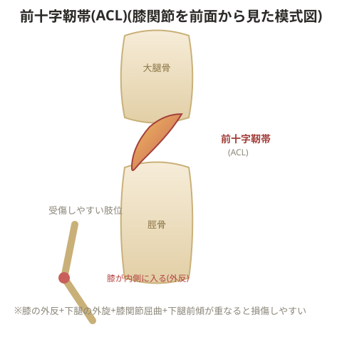

# ACL損傷(前十字靭帯損傷)

## 損傷の要因

膝関節屈曲位、下腿の外旋・大腿骨の内旋、膝関節の外反、下腿の前傾。この状態が重なると前十字靭帯が最大に伸長され損傷を起こす。

> 💡 **基礎知識: なぜこの組み合わせが前十字靭帯に負担をかけるのか**
> 前十字靭帯(ACL)は、大腿骨に対して脛骨(すね)が前方へずれる動き(前方引き出し)と、内側にねじれる動き(内旋)を制動する役割を持つ。膝が内側に入る(外反)姿勢は、大腿骨に対して脛骨が相対的に外旋・前方移動する力を強め、さらに下腿が前傾している(膝がつま先より前に出ている)状態は、体重による力がより真上からではなく前方向にかかりやすくなる。これらが同時に重なると、ACLが本来制動すべき複数方向の力が一度に集中し、靭帯の耐久限界を超えて損傷に至る。着地・切り返し動作の指導で「膝を内側に入れない」「つま先より前に出さない」ことが繰り返し強調されるのは、この力学的な仕組みに基づく。

## 予防

- 下腿の前傾を防ぐため、膝下にバンドを巻いて後ろから引いた状態で屈曲する動作(ワンレッグスクワットなど)を習得し、前に体重をかけられるようにする。膝が前に出ないよう前から手で押さえて行う方法も有効
- ACL手術後のクライアントは膝を曲げるのが怖く、ワンレッグ種目では体重が後ろにかかりがちになる。バドミントンなどでも、まっすぐ体重をかける分には損傷しにくい。むしろ体重を前にかけられず低筋力のままスポーツを行い、関節を支えきれず靭帯を伸ばしてしまうリスクの方が高い

## 小殿筋のトレーニング

膝が外反するのを防ぐには、膝関節で回旋動作をするのではなく、骨盤帯から回旋できるようにする。殿筋群(大殿筋・中殿筋・小殿筋)のうち、大殿筋は体重を後ろに乗せる働き、中殿筋は外転動作を担う。小殿筋を鍛えることで膝への負担を減らせる。

> 💡 **基礎知識: 股関節の筋力不足がなぜ膝の外反を招くのか**
> 方向転換やジャンプの着地で体を制御する際、本来は股関節周りの筋肉(中殿筋・小殿筋など)が骨盤・大腿骨のねじれを制御し、膝から下の動きを安定させる土台になる。この股関節の制御力が弱いと、骨盤が本来止めるべきねじれを止めきれず、そのねじれが膝関節にそのまま伝わってしまい、膝が内側に入る(外反する)動きとして表れる。これは「膝が悪い」というより「膝の上にある股関節のコントロールが不十分」という運動連鎖の問題として捉えられ、ACL損傷予防で股関節・殿筋群のトレーニングが重視される理由になっている。

- 種目例: ステップ台に片脚をかけ、すぐに回旋させる動作を繰り返す

## 競技による判断

- ステップ数を増やすことで膝の外反を防げる場合は、反対側の足をうまく利用する
- 動作の速さが求められステップ数を増やすとパフォーマンス低下につながる競技では、小殿筋のトレーニングでカバーする

