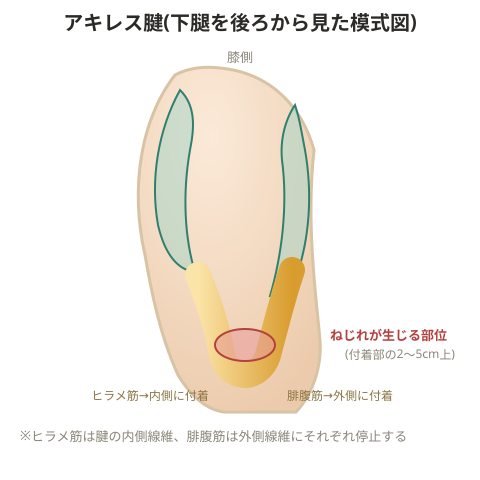

# アキレス腱炎・腱周囲炎

## 原因(多数の要因)

- 腓腹筋・ヒラメ筋の柔軟性低下・機能低下
- 走行の方向転換、曲線での走行
- 前脛骨筋の張り(腓腹筋・ヒラメ筋の拘縮を伴う)
- 地面が極端に柔らかい(芝生や雨によるぬかるみなど)
- シューズの踵部分の変形、偏平足、踵骨の不安定性(靴紐が緩い・合っていない)
- オーバープロネーション
- 地面が極端に滑りにくい(湿度の高い体育館など)
- ジャンプの着地や踏み込み
- ソールの内外側の減り方が不均等、ソールが軟らかすぎる・硬すぎる
- 下腿三頭筋に負担がかかりやすい動作
- コアの弱さ、大殿筋の機能低下
- 加齢による筋力低下、踵骨の不安定性

## 症状

アキレス腱の炎症・アキレス腱周囲の炎症、新生血管の増加。足関節背屈時の腓腹筋の反応が薄くなり、アキレス腱に負担がかかる。

## 4つのタイプの違い

**①アキレス腱炎**
アキレス腱の付着部から2〜5cm上の部分に圧痛が内側端または外側端に集中する。硬結・浮腫を伴う。

**②アキレス腱周囲炎**
アキレス腱周囲の膜(パラテノン)に炎症が生じる。同じく2〜5cm上の部分でパラテノンが肥厚し下腿筋膜と癒着を起こす。痛みの範囲が広く、握雪音(雪を握った時のような音)を伴うこともある。硬結・浮腫を伴う。

**③アキレス腱付着部炎**
アキレス腱が踵に付着する部分に炎症が起こる。背屈時に強い痛みが出る。処置せず進行すると安静時にも痛みが出るようになり、付着部に腫れが出る。線維性軟骨の骨化やアキレス腱前方の腱線維の断裂を伴うこともある。

**④アキレス腱滑液包炎**
フォアフット(足の前部)で外側から接地して内側に流れるフォームの選手で、踵骨がスライドしアキレス腱と擦れることで起こりやすい。滑液包の肥厚を伴う。

## リハビリ

エキセントリックトレーニング(膝伸展位で行う)により修復を促す。

> 💡 **基礎知識: なぜエキセントリック運動が腱の修復を促すのか**
> 腱の細胞(腱細胞)は、加わる力学的な張力を感知して、その方向・強さに応じてコラーゲン線維を並べ替える性質を持つ(メカノトランスダクション)。エキセントリック収縮(筋肉が伸びながら力を発揮する動作)は、腱に対して一定方向にコントロールされた強い張力を段階的に与えることができ、これが乱れて配列していたコラーゲン線維を、力のかかる方向に沿って整列し直すよう促す刺激になると考えられている。踵を落とす動作(かかとを浮かせた状態からゆっくり下ろす)を繰り返すプロトコルが慢性のアキレス腱炎に広く使われるのはこの仕組みに基づく。

## 備考

- アキレス腱は停止部の2〜5cm上でねじれが生じる構造になっている。ヒラメ筋は踵骨内側に、腓腹筋は踵骨外側に付着する
- 疼痛を誘発する動作でも、最大値の半分程度の負荷であれば治癒を妨げない

> 💡 **基礎知識: 「痛みが少し出る程度の負荷」がなぜ許容されるのか**
> 完全に痛みのない範囲だけで運動を続けると、腱に十分な力学的刺激が加わらず、修復に必要なコラーゲンの再構築が進みにくい。一方で強すぎる負荷は組織を再び損傷させる。臨床的には、運動中・運動後の痛みが自制内(目安として10段階中3〜5程度、翌朝には元のレベルまで引く)であれば、腱の修復を妨げるほどの過負荷にはなっていないと判断されることが多い。この「多少の痛みは許容し、悪化のサインだけを注意深く監視する」という考え方は、腱障害のリハビリテーション全般で広く採用されている。
- 左右の踵骨の大きさに差がないか確認する
- ヒラメ筋はアキレス腱の内側線維に停止するため、膝が屈曲し回内が起きるとヒラメ筋が強く牽引される。腓腹筋はアキレス腱の外側線維に停止する

> 💡 症例メモ: ある選手は腓腹筋の柔軟性が高すぎる(緩い)ため、腱同士がうまく擦れ合わず、逆にアキレス腱周囲炎につながったケースがある。柔軟性は「高ければ高いほど良い」わけではない一例。

