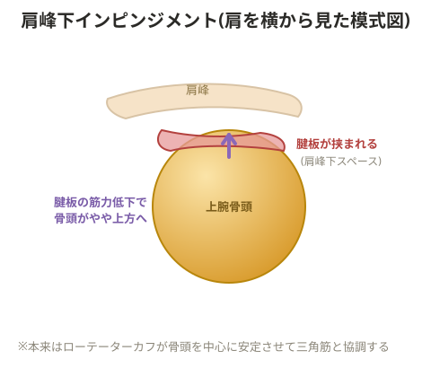

# インピンジメント症候群(肩)

水泳・テニス・オーバーヘッドでの投球動作で起きやすい。

> 💡 **用語解説: ローテーターカフ(腱板)**
> 棘上筋・棘下筋・肩甲下筋・小円筋の4つの筋肉の総称。これらを過剰に伸長させることで炎症が起きる。
> - 棘上筋: 肩関節の伸展から内転に関わる
> - 棘下筋: 肩関節の内旋から伸展に関わる
> - 肩甲下筋: 肩関節の外旋から屈曲に関わる
> - 小円筋: 肩関節の内旋から伸展に関わる

腱板が損傷すると関節の腫れを起こす。腱板と骨の間の隙間が狭くなり関節包を挟み込んで炎症を起こすのがインピンジメント症候群。

> 💡 **基礎知識: 「隙間が狭くなる」仕組み(肩峰下スペースの力学)**
> 腕を上げる動作では、本来ローテーターカフが上腕骨の骨頭を関節窩の中心に引きつけて安定させながら、三角筋が腕を持ち上げる、という2つの筋群が協調して働く(力のバランス、フォースカップル)。ローテーターカフが弱くなると、この安定化がうまく働かず、腕を上げる際に骨頭がわずかに上方へずれてしまい、その上にある肩峰(肩甲骨の突起)との隙間(肩峰下スペース)が狭くなる。この狭くなった隙間に腱板や滑液包が繰り返し挟み込まれることで炎症が起こる。ローテーターカフを鍛える対応は、単に筋力を強くするというより、この骨頭を安定させる本来の役割を取り戻し、隙間を確保することを目的にしている。

## 症状

肩の痛み、腕を上げにくい、後ろに手を伸ばすと痛む、肩を動かすとこすれる感覚がある。

## 対応

運動を中止しアイシングを行う。ローテーターカフを構成する4つの筋肉のうち、どれが弱っているかを確認する。

**例: 棘上筋が原因の場合(肩関節伸展から内転で症状が出るタイプ)**
- 肩関節伸展筋群(広背筋、大円筋、上腕三頭筋)・内転筋群(広背筋、大胸筋)を弛緩させる
- インナーマッスルである棘上筋を鍛える

