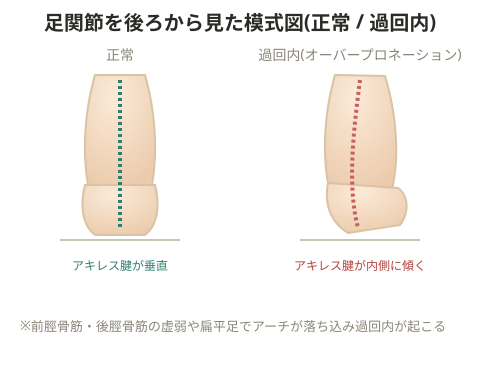

# オーバープロネーション

## 原因

**環境・練習要因**: シューズの内側が低い・削れている

**フィジカル要因**
- 長腓骨筋・短腓骨筋の硬縮、前脛骨筋・後脛骨筋の虚弱
- 立方骨の落ち込み(足部アライメントが崩れ回内が強調される。長腓骨筋の機能低下・虚弱により起こる)
- 扁平足(前脛骨筋・後脛骨筋・長腓骨筋の機能低下・虚弱)
- 内反膝(代償動作として回内が強まる)
- 外反膝(過剰に内側へ体重が乗る)
- 足底の筋力不足(アーチが下がり回内が強調される)

## 症状

- 足部のアライメントが崩れる。本来、蹴り出しの屈曲ポイントは第1中足骨頭〜第5中足骨頭を結ぶ横アーチだが、過回内が起きると屈曲ポイントが第1中足骨頭から真横に引いたラインにずれ、基節骨・中足骨のはまりが悪くなる。楔状骨より上は通常通り連動しようとするため、間に挟まれる中足骨の疲労骨折リスクが上がる
- 膝関節・半月板への負担増加(足関節の回内が強く、着地時に膝が内側に入る)
- 小指球に体重が乗らない(踵骨〜第1中足骨頭のアーチを軸に足関節が回内して走るため)
- シンスプリント、脛骨疲労骨折(衝撃を逃がせない)
- アキレス腱炎・腱周囲炎(アキレス腱内側に過剰な負担)
- 足底筋膜炎(足底筋膜の過剰な伸長)
- 外反母趾(アライメント異常)
- アーチの高さに左右差が出る
- ランニング時に膝が外反、または過剰に内反する

## 改善方法

- 前脛骨筋・後脛骨筋の強化: タオルギャザー、バンド抵抗トレーニング
- 長腓骨筋・短腓骨筋のストレッチ、および強化(バンド抵抗トレーニング)
- 横アーチで踏み切る反復動作(母指球〜小指球の屈曲動作)の習得
- フォームに合ったシューズの選択、インソールの使用

> 💡 **基礎知識: 足のアーチが「巻き上げ」で硬くなる仕組み(ウィンドラス機構)**
> 足の指を反らせる(背屈させる)と、足裏を走る足底筋膜が指の付け根の骨に巻き取られるように引っ張られ、これによって足のアーチが自動的に持ち上がり足全体が一時的に硬い「てこ」のような状態になる(ウィンドラス機構)。蹴り出しの瞬間に指が反ることでこの機構が働き、地面を効率よく蹴れる硬さが生まれる。オーバープロネーションで足部のアライメントが崩れると、この巻き上げが正しいタイミング・部位で起こらず、蹴り出しの効率が落ちるだけでなく、本来分散されるはずの力が特定の骨(中足骨など)に集中し、疲労骨折のリスクが高まると説明できる。

## 備考

- ランジ動作では膝が内側に入らないように行う
- 低筋力の人に起きやすい(原文では「低筋力が少ない人に起きやすい」とあるが、実質的には筋力不足が背景にあるケースが多い)
- シューズのヘリの削れ具合を確認し、削れていたら交換する。放置すると症状を強めてしまう

## 回内・回外の本質的な役割

> 💡 回外・回内は衝撃吸収そのものが目的ではない。衝撃吸収は主に足関節の屈曲・伸展によって行われている。回外・回内の動作はすべて推進力の生成につながっている。

- ボールを投げる動作でも、回外・回内、内旋・外旋を加えることでスピンが生まれる。スピンがかかった方が同じ力でもパワーが上がる
- 回内・回外は主にインナーマッスルで行われ、内旋・外旋はインナーとアウターの両方で行われる
- 衝撃吸収がうまくできていない選手には、足関節を構成する一つ一つの骨の屈曲・伸展を良くするイメージを持たせる
- 回内・回外に問題があるとパフォーマンスに影響する
- 「弱い力で推進力を生み出す」というイメージを持たせることが指導のポイント

