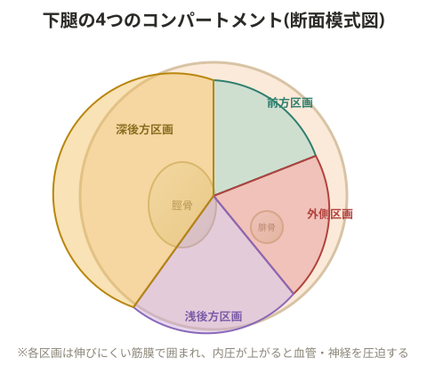

# コンパートメント症候群

下腿は4つの区画(コンパートメント)に分かれている。骨折や筋損傷などによりコンパートメント内の圧力が高まると、内部の血管が圧迫されて血行不良が起こり、最悪の場合は組織が壊死する。

> 💡 **基礎知識: なぜコンパートメント内の圧力上昇が危険なのか**
> 各コンパートメントは筋膜という伸びにくい膜で囲まれた閉じた空間になっている。出血や筋肉の腫れによってこの空間の内圧が上がると、風船が内側から膨らんで中の物を圧迫するように、内部を通る血管・神経が圧迫される。血管が圧迫され血流を送る圧力(灌流圧)がコンパートメント内圧を下回ると、その先の組織に酸素・栄養が届かなくなり、数時間という短い時間で筋肉や神経が不可逆的な壊死に至ることがある。この病態は進行が早く緊急性が高いため、患部の激しい痛み(特に他動的に伸ばした時の激痛)・しびれ・脈拍の触れにくさなどの兆候が見られた場合は、様子を見ずに直ちに医療機関を受診する必要がある。

> ⚠️ コンパートメント症候群は進行すると数時間単位で不可逆的な組織壊死に至る可能性がある緊急性の高い病態。強い痛み・しびれ・脈の触れにくさなどの兆候があれば速やかに医療機関を受診すること。

