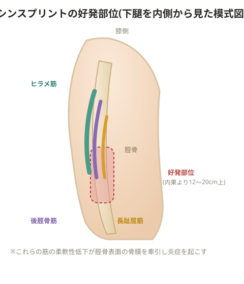

# シンスプリント

## 原因

**練習・環境要因**: オーバーユース、繰り返しのランニング・ジャンプの過度な実施、過度な運動量・時間・内容、硬い路面、薄く硬い(踵の摩耗した)シューズ

**フィジカル要因**
- 柔軟性不足(ヒラメ筋、腓腹筋、後脛骨筋、足底筋群、腓骨筋)
- 足関節の可動域制限(衝撃を逃がせない。筋の柔軟性不足、アップ不足、骨の制限による)
- 下肢全体の柔軟性低下(衝撃を逃がせない)
- 過回外(足底筋群で衝撃を逃がせない)
- 扁平足(オーバープロネーションを起こしやすい)

> 💡 骨膜炎のほか、ヒラメ筋の筋膜炎、後脛骨筋・長母趾屈筋・長趾屈筋の炎症も関与する。下腿内側の柔軟性低下(特にヒラメ筋・後脛骨筋・長趾屈筋の付着部が脛骨表面を覆う骨膜を牽引し、微細損傷=骨膜炎を起こす)が下腿内側の痛みの主因になる。

- オーバープロネーション(過回内)、内反膝(衝撃が一点に集中しやすく、オーバープロネーションも招く)
- 腓腹筋・ヒラメ筋・前脛骨筋・後脛骨筋・長趾屈筋の柔軟性不足(筋肉で衝撃を吸収できず脛骨で受け止めてしまう。体幹の虚弱も関与)
- 腓骨筋の短縮、仙腸関節の可動性低下、コンパートメント症候群からの発展(内圧上昇が疲労骨折を招く)

## 症状

下腿内側(主に脛骨内縁中央1/3、目安として脛骨内果より12〜20cm上)の圧痛、運動時痛、腫脹。足屈筋への抵抗運動で痛みが増強する。脛骨の脇から触ると激痛が走り、腫れで判別できることもある。

- 上部が痛い: 比較的頻発するパターン
- 中央が痛い: 上下動の大きいフォームに多い
- 下部が痛い: 過剰な内反によるもの

**進行度(ステージ)**
- Stage1: 痛みはあるがウォームアップで消失する
- Stage2: ウォームアップで消失するが、活動終了間際に痛む
- Stage3: 日常生活に支障はないが、活動中は常に痛む
- Stage4: 局所の痛みが常にあり日常生活にも支障が出る

> ⚠️ Stage3以上になったら病院で検査を受けること。

> 💡 **基礎知識: シンスプリントと疲労骨折は「連続した状態」**
> シンスプリント(骨膜炎)と脛骨疲労骨折は、まったく別の病気というより、同じ「骨がストレスに耐えきれなくなっていく過程」の異なる段階として捉えられる(骨ストレス障害の連続性という考え方)。繰り返しの負荷に骨の修復(リモデリング)が追いつかなくなると、まず骨の表面を覆う骨膜に炎症が起こり(シンスプリント)、それでも負荷をかけ続けると骨内部にまで微細な損傷が進行し、最終的には骨に亀裂が入る(疲労骨折)。ステージが進むほど回復に必要な期間が長くなるため、初期段階(Stage1〜2)で見つけて負荷を調整することが、疲労骨折という大きな怪我を防ぐ最も効果的なタイミングになる。

## 検査

骨膜の炎症のため、レントゲンでは変化が出ないのが一般的。後に骨変化が出れば疲労骨折と診断される。MRIでは脛骨骨膜に肥厚した高信号変化(白色)が見られることがある。疑わしい筋を収縮させて痛みが出るかで、原因筋を特定する。

## 鑑別が必要な疾患

脛骨疲労骨折、コンパートメント症候群。疲労骨折の初期像とは鑑別が難しいことが多いが、初期治療法は同様でよい。付着部の筋腱炎もほぼ同様の対応でよい。

## 治療

運動量の中止・制限、局所の安静、アイシング・アイスマッサージ(シンスプリントでは特にしっかり行うこと)、消炎鎮痛剤、形態補正のための足底板。

## リハビリの段階

**急性期(痛みが強い)**: ランニングを完全に休止し、下肢の荷重運動を避け水泳・エアロバイク(踵でペダルを踏むイメージ)を行う。股関節・足関節・アキレス腱のストレッチ、原因へのアプローチを行う。

**自発痛・歩行時痛が消失後**: 足趾でのタオルギャザー、足関節の軽いチューブトレーニング(フルレンジで)

**圧痛(押した時の痛み)が消失後**: ウォーキングから開始し、両脚踏み切りジャンプで痛みが出なければ軽いランニングを再開(硬い路面は避ける)

## 予防

下腿前面・後面の静的ストレッチ、マッサージやアイシングなどのアフターケア、足底のケア、フォーム・姿勢の矯正、衝撃吸収性の高いシューズ選び、インソールでのアライメント修正、しっかりしたアップ(下腿の血流量を上げることが重要)。

## 備考

- 疲労骨折は脛の下1/3がやや曲がっていることとストレスのかかり方が原因になりやすい
- シンスプリントはアライメント(特に過回内)、アーチの状態、筋疲労の程度などが複雑に絡み合って発生する
- チェック項目は骨格(姿勢)・筋肉の状態などの内的要因と、接地角度・フォーム・シューズ・グラウンドなどの外的要因の両方に及ぶ
- 腸脛靭帯炎を起こしやすい選手かどうかも確認する。内転筋が弱く大腿筋膜張筋・大殿筋が硬いと内反膝になり腸脛靭帯炎を起こしやすく、同時に足関節の回内も起きやすい

