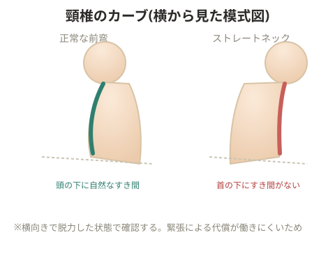

# ストレートネック(チェック方法)

横向きに寝た人を横から見た時、首の下に手が入らない人はストレートネックであると判断できる。

> 💡 詳しい原因・改善策は「FRAT頸椎」のページを参照。

> 💡 **基礎知識: なぜこの姿勢でチェックするのか**
> 横向き(または仰向け)に寝てリラックスした状態は、筋肉の緊張による代償がほとんど働かない、骨格本来のカーブが最も現れやすい姿勢になる。本来の頸椎は緩やかに前弯しているため、平らな床に対して首の下に自然なすき間ができる。このすき間に手が入らない場合、頸椎の前弯そのものが失われ、まっすぐ(ストレート)になっている可能性が高いと判断できる。立った状態や座った状態では筋肉の緊張・意識的な姿勢の作り込みで本来のカーブが隠れてしまうことがあるため、脱力できる臥位でのチェックが用いられる。

