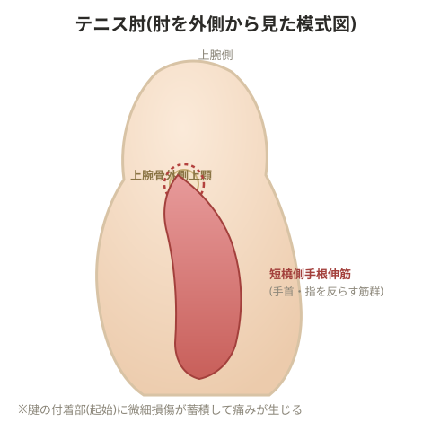

# テニス肘

肩甲骨の可動性不全があると、本来肩甲骨が担うべき動作を肘が代償してしまい、肘を痛める原因になる。

> 💡 **用語解説: テニス肘(上腕骨外側上顆炎)**
> 肘の外側にある骨の出っ張り(上腕骨外側上顆)に付着する手首・指を反らす筋肉(短橈側手根伸筋が中心)の腱に、微細な損傷と変性が蓄積して起こる痛み。名前の由来であるテニスのバックハンド動作だけでなく、パソコン作業やドアノブを回す動作など、手首を反らす動きの繰り返しでも起こる。

> 💡 **基礎知識: なぜ肩甲骨の動きの悪さが肘の痛みにつながるのか**
> ラケットを振る、物を持ち上げるといった腕の動作は、本来「肩甲骨(体幹に近い大きな部位)→肩関節→肘→手首」という順番で、体幹に近い大きな筋肉から力を出し、末端(手首・肘)は微調整だけを担う、という運動連鎖で行われるのが効率的とされる。肩甲骨が硬く十分に動かないと、この連鎖の入り口部分で力がうまく生み出せず、体は無意識のうちに末端の肘・手首の筋肉によけいな仕事をさせて動作を成立させようとする。本来なら分散されるはずの負荷が、力を出す構造としては弱い肘周辺の腱に集中してかかり続けることが、テニス肘のような使いすぎによる腱の障害につながると説明できる。

