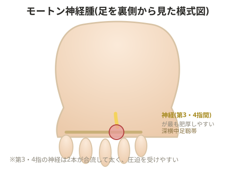

# モートン神経腫

## 原因

足裏の付け根に繰り返しかかる負担が主な原因。歩行時、地面を蹴る際に足指が背屈し付け根に負荷がかかることで、すぐ下にある神経や周囲の軟部組織が繰り返し圧迫され、加齢とともにこの部位が線維化することで発生する。

> 💡 **用語解説: 神経鞘・良性腫瘍としての性質**
> 神経の周りを覆い、神経線維の保護や再生に関わる組織(神経鞘)がストレスを受けて肥厚する。この神経鞘から発生する良性腫瘍であり、悪性であることはまれ。

槌趾変形がある場合や、中腰の作業・ハイヒールの常用などでMP関節(中足趾節関節、足指の付け根の関節)でつま先立ちする姿勢が続くと、足趾に向かう神経が「深横中足靱帯」(中足骨間をつなぐ靭帯)のすぐ足底側を通っているため、この靭帯と地面の間で神経が圧迫され発症する。

> 💡 **基礎知識: なぜ第3・第4指の間に最も多く発生するのか**
> 足の指へ向かう神経は本来1本ずつ独立して伸びているが、第3指と第4指の間を通る神経だけは、内側と外側から伸びてきた2本の神経(内側足底神経・外側足底神経の枝)が合流してやや太くなっている解剖学的な特徴を持つ。神経が太くなっている分、周囲の靭帯・骨との間で圧迫を受けやすく、可動性も他の指間に比べて低いため、繰り返しの圧迫ストレスが集中しやすい。モートン神経腫が第3・第4指の間に好発するのは、この神経の合流という解剖学的な構造が背景にある。

## 改善策

- ハイヒールを履かない
- つま先立ちをしない
- 骨の間の筋肉をほぐす
- 骨の間の筋肉を動かす

