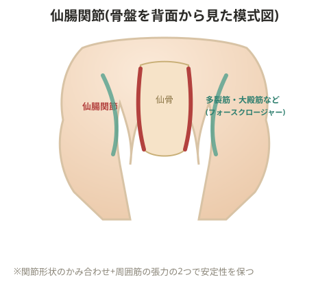

# 仙腸関節炎

> 💡 **基礎知識: 仙腸関節が安定する2つの仕組み**
> 仙腸関節(骨盤の中央、仙骨と腸骨をつなぐ関節)は他の関節に比べて可動域が非常に小さく、その安定性は主に2つの仕組みで保たれている。①関節面そのものの形状がかみ合っている「フォームクロージャー(形状による締結)」、②周囲の靭帯・筋肉(多裂筋、大殿筋、梨状筋、腹横筋など)の張力によって関節面を押し付け合う「フォースクロージャー(力による締結)」。周囲の筋肉の柔軟性が低下したり、逆に筋力が不足してこの締め付けが弱まったりすると、本来ごくわずかしか動かない関節に余分な動きやストレスが生じ、炎症につながると考えられている。

## 原因

- 大殿筋・中殿筋・梨状筋の柔軟性不足
- 側弯、骨盤の傾き、上半身の傾き
- 坐骨神経痛
- 腰椎の過前弯

