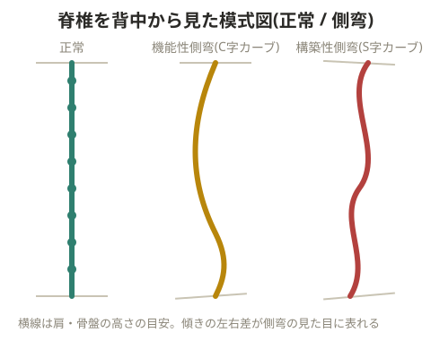

# 側弯症

## 原因

- **先天的**: 原因不明のケースが多い
- **後天的**: 生活習慣による不良姿勢(バイオリン奏者、常に片側で荷物を持つ人など)

## 側弯によって起こる影響

- 衝撃を逃がしにくくなり、椎間板の片側が押しつぶされてヘルニアになりやすくなる
- 左右の肩の高さが変わり、姿勢が悪く見える
- 拘縮している側の肋骨が広がりにくくなり、呼吸に影響する
- 骨盤が傾くことで見かけ上の脚長差が生じ、自然な歩行ができなくなるため、膝関節・足関節にも悪影響が及ぶ

## 対応策

**先天的な場合**: 拘縮している側の筋群(脊柱起立筋、横突棘筋など)を弛緩させ、反対側は鍛える。

**後天的な場合**: どのような不良姿勢が片側の拘縮を招いたかを考える。
- バイオリン奏者の例: 片側にバイオリンを持ち続けることで腹斜筋を使い片側に傾く姿勢になる。拘縮している側の内外腹斜筋を弛緩させ、反対側をトレーニングする。パフォーマンスへの影響が懸念される場合は、トレーニングは行わず弛緩のみ行う
- 片側の肩でばかり荷物を持つ人には、持ち方の習慣自体を改善してもらう。過剰に使っている側だけでなく、両サイドの筋バランスを整えることが重要

片側の腸腰筋だけが硬縮していると骨盤が傾き、それを補正するため胸椎が反対側に湾曲し、頸椎もバランスを取ろうとする。座っている時は側弯が見られず立った時だけ側弯する人は、骨盤の傾きに何らかの問題がある可能性が高い。

## ケーススタディ: 12歳女性の側弯症

> 💡 **用語解説: 機能性側弯と構築性側弯**
> 立位で側弯があっても座位・側臥位で消失する場合は「機能性側弯」(脊椎自体には問題がなく、脚長差や姿勢が原因)。立位・座位・側臥位いずれでも側弯が見られる場合は「構築性側弯」で、その約80%は原因不明(特発性側弯症)とされる。神経障害や疾患により背中・体側の筋肉が麻痺して脊椎を支えられなくなるケースも構築性側弯に含まれる。

- 12歳の女子選手の場合、最も考えられるのは特発性側弯症。10歳以降の成長期の女性に多いという特徴がある

> 💡 **基礎知識: なぜ成長期に側弯が進行しやすいのか**
> 骨は成長期に急速に伸びるが、この時期はまだ骨の強度が完成しておらず、周囲の筋肉・靭帯によるサポート力とのバランスが崩れやすい。また骨自体にも力学的な負荷に応じて成長速度が変わる性質があり(ウォルフの法則の応用)、わずかな左右差が生じると、圧迫される側の椎体の成長がやや抑えられ、逆に引っ張られる側がより伸びるという悪循環(くさび状の変形)が起こりやすくなる。成長のスピードが最も速い時期(思春期の成長スパート期)に側弯のカーブが急速に進行しやすいとされるのは、この骨の成長メカニズムと関係している。そのため成長期の側弯は進行速度の定期的なチェックが特に重要になる。
- 情報収集では、先天的なものではないか、進行速度はどうかを確認し、原因を絞り込む
- **要因**: 骨盤の左右高低差(梨状筋の硬縮による脚長差、下腿の手術歴、内反膝・外反膝など)、不良姿勢(音楽・スポーツなどで片側にばかり力が入り左右の筋バランスが崩れる)
- **改善方法**: 側弯が20度以上の場合は装具治療、45度以上になると見た目・呼吸機能・神経症状への影響が出るため手術を検討。20度以下は経過観察

## ケーススタディ: 65歳女性の側弯症

- 機能性側弯を想定して原因を追究する
- **要因**: 12歳のケースと同様の骨盤高低差・不良姿勢に加え、低筋力により脊椎を支えられなくなっていることも要因になる
- **改善方法**: 柔軟性の左右差をなくし筋バランスを整える(脚長差・不良姿勢の改善)。脊椎のバランスボールによる動的ストレッチ、全身(特に体側・背部)の動的ストレッチを行う。硬縮している側は動的ストレッチ、伸びている側はトレーニング(内外腹斜筋、インナーマッスル)を行う。胸椎の回旋運動で脊椎のアライメントを整える

> 💡 靭帯の緊張バランスが不良なことも側弯の一因になる。また、片脚に痛みが生じると反対脚に体重を乗せて重心が移動し、骨盤が傾いた状態が続くことで側弯が生じることもある。

