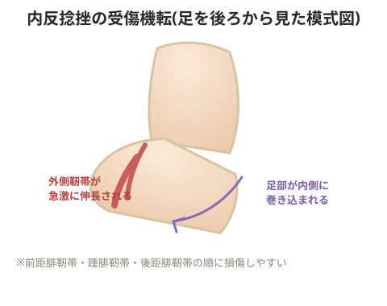

# 内反捻挫

## 損傷しやすい靭帯

内反捻挫で起きやすいのは足関節外側側副靭帯の3つ。

- 前距腓靭帯
- 踵腓靭帯
- 後距腓靭帯

## 重症度分類

- 1度: 靭帯の軽度損傷
- 2度: 靭帯の部分断裂
- 3度: 靭帯の完全断裂

> 💡 靭帯は基本的に「伸びる」ことはなく、切れているか切れていないかのどちらか。

## リハビリの進め方

**①受傷靭帯の確認**: 圧痛の場所、足関節の緩さ、浮腫、炎症、熱感を確認する。

> ⚠️ 腫れが上の方まで広がっている場合は脛骨外顆の骨折リスクがあるため注意する。

**②患部内出血期**: 患部の中で内出血が起き、全体的にぼんやりと腫れて内出血する。

**③腫れが引き痛みが弱まる時期**: 動けるようになるため、逆に1度捻挫はしっかり治りきらないまま放置されやすい。全く動かさないと血流が生まれず回復が遅れるため、適度な生活動作も必要。

> ⚠️ 患部周辺が内出血している炎症期は、アイシング・アイスバスを行う。

**④内出血が下方へ移動する時期**: 何日目に内出血が下方へ移動し始めたかを記録しておく。

> 💡 **基礎知識: 内出血が「下に移動していく」仕組み**
> 損傷部位に溜まった血液・組織液は、その場に留まり続けるわけではなく、重力の影響を受けて皮膚の下を徐々に下方へ移動していく。これは血液自体が組織の隙間を伝って流れ落ちる現象で、患部の真上ではなく、時間が経つにつれて足首の下方(足の甲や指の付け根あたり)に内出血の変色が現れるのはこのため。この移動が始まっている(内出血が下がってきている)ことは、体が損傷部の血液を少しずつ処理・排出し始めている前向きなサインとして捉えられる。

**⑤下方に浮腫が溜まる時期**: 内出血が下に集まり浮腫として残る。安静にしていると溜まったままになりやすい。
- ウォーキングを開始する(内反・外反が起きないよう注意)
- オイルマッサージで浮腫を流す(患部は避けて周辺から押し流す)
- 浮腫の位置が下がってきたら、歩く・流す・交代浴を組み合わせる

**⑥ランニング開始**: カーボンシューズ使用時や捻挫後は足関節が不安定になりやすく、長腓骨筋の張りが強くなるためケアが必要。長腓骨筋と引っ張り合う内側腓腹筋も張りやすいためケアを行う。

## リハビリ運動

- 足関節回外トレーニング(腓骨筋トレーニング: 靭帯のサポート役として腓骨筋を鍛える)
- 足関節背屈トレーニング(長趾伸筋・前脛骨筋トレーニング: 距骨を安定させ前方変位を抑える)
- 母指球・小指球・踵にバランスよく体重を乗せるエクササイズ(ランジ、両脚スクワット、片脚スクワットなど)

## 備考

- 足関節前側の痛みがある場合は距骨の前方変位を疑う
- ベイパー系シューズは重心が高くなるため、高い位置から落ちる形になり内反が強く出やすい

## 実例(回復記録)

ある選手の内反捻挫からの復帰の実例:
- 4月4日: 外反捻挫受傷
- 4月8日: オイルマッサージ実施
- 4月9日: 腫れがかなり引き、ウォーキング開始
- 4月14日: ランニング開始
- 4月25日: ポイント練習(質の高い練習)開始
- 5月5日: 完全合流

