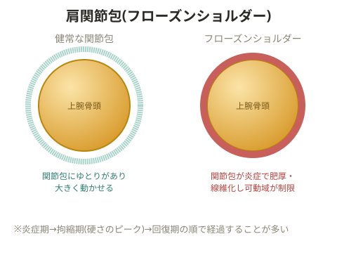

# 四十肩・五十肩(フローズンショルダー)

> 💡 **用語解説: フローズンショルダー(肩関節周囲炎)**
> 一般に「四十肩・五十肩」と呼ばれる状態。軟部組織の軽度の炎症により、肩関節周囲炎として痛みや可動域制限が起きる。中年女性や糖尿病を持つ人はなりやすい傾向がある。

## 症状の段階

1. 日中に痛みがあるが、関節の動き自体には問題がない
2. 日中・就寝時ともに痛みがあり、関節の動きにも制限がある
3. 痛みはないが、硬さが残る

## 原因

加齢とともに肩の回旋動作の機会が減り、回旋筋腱板(ローテーターカフ)が使われなくなって筋肉が硬くなる。筋肉が十分に伸び縮みしなくなることで、腱に負担がかかってしまう。

> 💡 **基礎知識: 「フローズン(凍結)」と呼ばれる関節包の変化**
> 肩関節は、関節全体を袋状に包む「関節包」という組織に覆われている。フローズンショルダーでは、この関節包そのものに炎症が起こり、次第に厚く硬く縮んでいく(線維化)ことが分かっている。関節包が縮むことで、関節そのものは壊れていなくても、物理的に動かせる範囲が制限されてしまう。これが「凍りついたように動かなくなる」という名前の由来。多くの場合、炎症期→拘縮期(硬さのピーク)→回復期という経過をたどり、関節包の炎症が落ち着くにつれて徐々に可動域も戻っていくため、症状の段階に応じた対応(急性期は安静、回復期は可動域訓練)が重視される。

## 対応

- 炎症がある時期は安静にする
- 治まってきたら回旋動作を取り入れていく
- 日常的に肩関節の外旋・内旋の動きを取り入れる

**肩関節内旋筋群**: 肩甲下筋、大胸筋、上腕二頭筋、三角筋、大円筋、広背筋
**肩関節外旋筋群**: 棘下筋、小円筋、三角筋

小さい動きから始め、インナーマッスルである肩甲下筋・棘下筋の伸長・収縮運動から行っていく。

