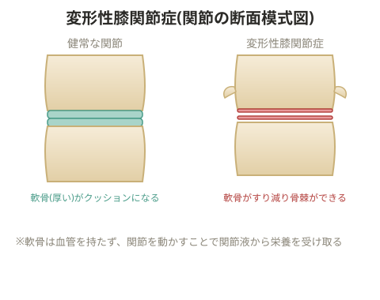

# 変形性膝関節症

膝の痛みは、低筋力・加齢によって発生率が高まると言い切れる。

## 原因

- 肥満
- 立つ・歩くなどの生活動作の不足、運動不足
- ビタミンK不足(不足していない人と比べ1.5倍のリスク)
- 高血圧・高血糖などメタボリスクが高いこと(加齢とともに活動量・筋力が減ることが背景にある)

## 危険因子

65歳以上、女性、膝の外傷経験、手術経験、遺伝。

## 構造と発症のメカニズム

膝関節は関節包に包まれ、その内側に滑膜、さらにその中に関節液がある。関節軟骨は膝のクッション材だが、成人の関節軟骨には血管・リンパ管・神経が通っていない。そのため関節液から栄養を吸収するが、動かさずにいるとうまく吸水できず、健康な状態を保てなくなる。繰り返し動かすことで関節液を軟骨に吸収させることが重要で、動作に制限がある人には手技によるアプローチも有効。

> 💡 **基礎知識: 軟骨が「動かすことで栄養をもらう」仕組み**
> ほとんどの組織は血管を通じて酸素・栄養を受け取るが、関節軟骨には血管が通っていないため、関節液に含まれる栄養分が軟骨の中にじわじわとにじみ込む「拡散」という現象だけで栄養供給を行っている。関節を動かして荷重をかけると、軟骨がスポンジのように圧迫・解放を繰り返し、この圧力変化がポンプのように働いて関節液の栄養分を軟骨内部まで押し込む効果がある(ポンプ作用)。逆に長時間動かさずにいると、この拡散だけに頼ることになり栄養供給が滞る。「関節を適度に動かすことが軟骨の健康維持につながる」という考え方は、この一風変わった栄養供給の仕組みに基づいている。

加齢とともに膝を使い続けると関節軟骨がクッションとして働かなくなり、やがてすり減って欠片が出る。この欠片が滑膜を刺激し関節液が過剰分泌される。また横にはみ出す骨棘化も起こる。グレード2の段階で痛み・こわばりを感じ始める。グレードを確認し、セッション内容に反映する。

## 原因の整理

1. 関節動作の欠如により関節軟骨が関節液を吸収できず、栄養・水分を取り込めなくなり健康な状態を保てなくなる
2. 過度な運動や肥満により、関節の長軸方向への負担が大きくなる
3. 膝関節安定筋群(大腿四頭筋、ハムストリングス、腓腹筋、縫工筋など)の筋力不足で膝関節が安定せず、関節軟骨に負担がかかる
4. ハムストリングスが大腿四頭筋より相対的に強いことで、日常的に膝関節が屈曲位に寄ってしまう
5. 靭帯・半月板の損傷により膝関節が不安定になり、関節軟骨に負担がかかる
6. 滑膜が傷つき、滑膜・関節包が厚くなることで関節可動域が低下する

## 要因

- 運動不足、日常生活での膝関節屈伸動作の欠如、座位中心の生活(①③④に関連)
- 病気や手術による長期間の不活動(①③④に関連)
- 肥満(②に関連)、更年期のランナー・運動選手(②に関連)
- 内反膝・外反膝(⑤に関連)
- ビタミンK不足(①に関連)

## 対応策

初期段階(フェイズ1)では、痛みのない範囲で膝関節屈伸動作を行い、予防としてレジスタンストレーニングを取り入れる。

**膝関節屈曲伸展運動**: 負荷の低いレッグカール、座位での膝関節伸展運動(レッグエクステンション)、ステップ台トレーニング、ウォーキング

膝関節を安定させる筋肉が弱いと関節内が不安定になり、ぶれが生じて軟骨を削ってしまう。それを防ぐため以下のトレーニングを行う。

**トレーニング**: スクワット、ステップ台トレーニング(強度アップ)、バイク、ランニング、大殿筋トレーニング(接地の安定化のため)

トレーニングで筋肉が硬縮すると関節内圧が高まってしまうため、ストレッチも合わせて行う。

**ストレッチ**: 大腿四頭筋、ハムストリングス、腓腹筋、縫工筋、大腿筋膜張筋

> 💡 変形性膝関節症は(他の慢性疾患と比べて)回復が比較的早い部類とされる。

## 段階的なプログラムの目安

| フェーズ | 内容 |
| --- | --- |
| フェーズ1 | 関節運動 |
| フェーズ2 | 関節運動を継続 |
| フェーズ3 | 筋トレ、肥満の解消(有酸素・食事・ストレス対策)、ストレッチを追加 |

## トレーニングプログラム例

| 課題 | 項目 | L1 |
| --- | --- | --- |
| フィジカルチェック | 膝関節可動域、内側広筋・外側広筋の力の入り方 | - |
| 膝関節内の環境改善 | 膝関節屈伸運動 | 椅子レッグエクステンション(徒手抵抗なし) |
| 膝関節をまたぐ筋の強化 | 大腿直筋のトレーニング | ワンレッグスクワット(支えあり)左右20回 |
| | 内側広筋のトレーニング | ワンレッグスクワット(支えあり・内側に高さ)左右20回 |
| | 外側広筋のトレーニング | ワンレッグスクワット(支えあり・外側に高さ)左右20回 |
| | ハムストリングスのトレーニング | レッグカール系 |
| | 腓腹筋のトレーニング | カーフレイズ左右20回 |

