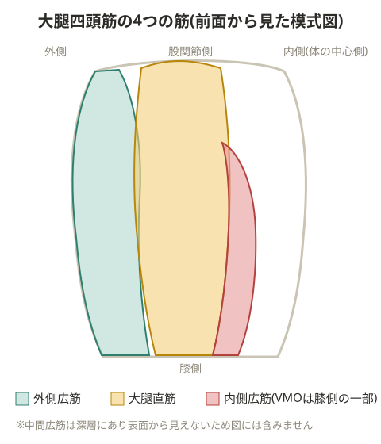

# 大腿四頭筋

## チェック基準の例

座位から反動を使って100回できる、片脚スクワットが30回できる、階段の昇降ができるか、といった基準で機能を確認する。

## 各筋の役割

- 大腿直筋・中間広筋: 主に強化される部分で、反発を使って体を持ち上げジャンプする動作に関わる
- 内側広筋・外側広筋: 膝関節の内反・外反に対する動的な安定性を担う。これらが関与しないと膝が不安定になるため、しっかり鍛える必要がある

> 💡 **基礎知識: 内側広筋(特にVMO)が膝のお皿の動きを制御する仕組み**
> 膝のお皿(膝蓋骨)は、膝を曲げ伸ばしする際に大腿骨の溝(滑車溝)の上を上下にスライドする。外側広筋を含む外側の筋群は膝蓋骨をやや外側に引っ張る力を持つため、内側広筋(特に膝関節に近い部分にある繊維、VMO=内側広筋斜頭)がこれに対抗して内側に引く力を発揮することで、膝蓋骨が正しい軌道(まっすぐ)でスライドするようバランスを取っている。内側広筋の筋力が外側に対して相対的に弱いと、膝蓋骨が外側に偏って動き(膝蓋骨のトラッキング異常)、軟骨への負担が偏ってジャンパー膝や膝蓋大腿関節の痛みにつながりやすくなる。

> 💡 中間広筋のケア不足は大腿骨疲労骨折の一因になりやすい。骨との接合面積が広いため、負担が集中しやすい。

