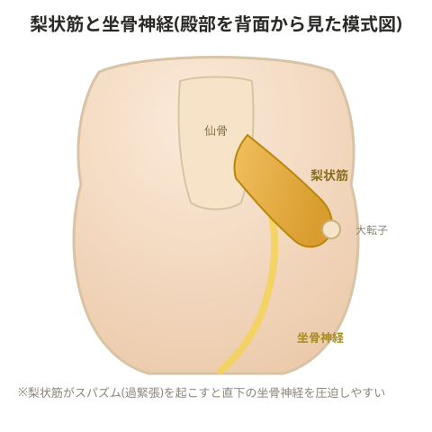

# 梨状筋症候群

## 仙腸関節炎との関連

- **上からのインパクト**(着地の衝撃など): 仙腸関節に影響が出やすい。体重が重いほど痛みが出やすく、梨状筋にも負担がかかりやすい
- **下からのインパクト**: 仙腸関節と恥骨結合に影響が出やすく、こちらも梨状筋に負担がかかりやすい

梨状筋が伸長されすぎるとスパズム(不随意な筋収縮)が起きやすくなる。梨状筋が使えなくなると、上下からの衝撃をうまく伝達・吸収できなくなる。

> 💡 **基礎知識: なぜ「伸ばされすぎる」と筋肉が反射的に縮むのか**
> 筋肉の中には筋紡錘というセンサーがあり、筋肉が急激に、あるいは過度に引き伸ばされたことを感知すると、これ以上組織が損傷しないよう反射的に筋肉を収縮させる防御反応(伸張反射)が働く。梨状筋が繰り返し過剰に伸長される状況(股関節の過内旋など)にさらされ続けると、この防御的な収縮(スパズム)が起こりやすい状態が慢性化し、常に張った状態になってしまう。張った状態の筋肉はすぐ近くを通る坐骨神経を圧迫しやすくなるため、「伸ばされすぎる→防御的に縮む→坐骨神経を圧迫する」という悪循環が生じる。

## 原因

- 股関節の運動による坐骨神経の圧迫
- 梨状筋の強い収縮・スパズム
- 腰椎の過前弯
- 股関節の過内旋

> 💡 腰椎が過前弯になると梨状筋が伸長され、本来中殿筋が担うべき役割まで肩代わりしてしまうことがある。臼蓋形成不全がある場合も同様の状態になりやすい。

## 対策

- 股関節のモビライゼーション(関節可動化)
- 股関節・膝関節周囲の筋力トレーニング

