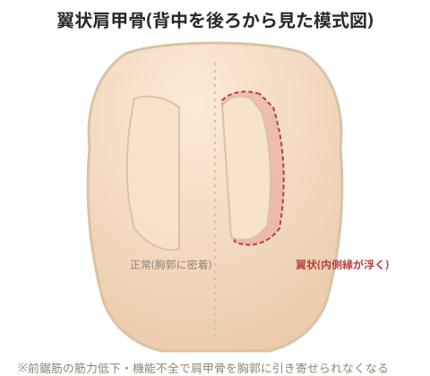

# 翼状肩甲骨

> 💡 **用語解説: 翼状肩甲骨**
> 肩甲骨が背中から翼のように浮き上がって見える状態。

前鋸筋(肩甲骨を胸郭に引き付ける筋肉)が過度に柔軟(緩んでいる)である可能性がある。

> 💡 **基礎知識: 前鋸筋が肩甲骨を「胸郭に貼り付ける」仕組み**
> 肩甲骨は骨同士の関節でしっかり固定されているわけではなく、筋肉の張力バランスだけで胸郭(肋骨の外側)の上に浮かぶように保持されている特殊な骨。前鋸筋は肩甲骨の内側縁から肋骨側面にかけて広く付着し、肩甲骨を胸郭に引き寄せて密着させる、いわば「肩甲骨を背中に貼り付けるベルト」のような役割を担っている。この筋肉の筋力が低下したり、機能不全(長胸神経の麻痺など)が起こったりすると、肩甲骨を胸郭に引きつける力が失われ、肩甲骨の内側縁が背中から浮き上がって見える(翼状肩甲骨)。腕を前に押し出す動作(壁を押す動作など)で症状が目立ちやすいのは、この動作でこそ前鋸筋が最も強く働く必要があるため。

