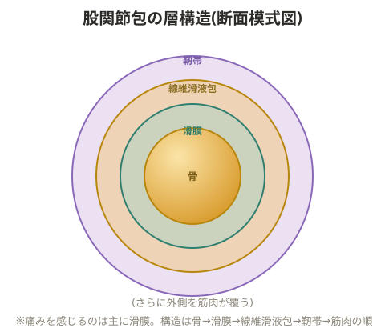

# 股関節周囲炎

股関節を取り巻く筋肉・靭帯・滑液包が炎症を起こしている状態の総称。

## 関連する代表的な疾患

**変形性股関節症**
軟骨自体には痛覚がないが、関節包・骨膜には神経がある。
- **1次性**: 解剖学的な異常はなく、加齢的なすり減りにより起こる。肥満や先天性の軟骨異常が関与
- **2次性**: 先天性股関節脱臼や臼蓋形成不全が長年放置されて起こる

> 💡 **用語解説: 臼蓋形成不全**
> 寛骨臼(股関節のソケット部分)と大腿骨頭のはまりが浅い・狭い状態。軟骨がすり減りやすく、初期には痛みが出にくいため発見が遅れがち。じっとしていれば痛みはほぼないが、動かすと痛む。臼蓋が浅いと大腿骨頭による突き上げで関節唇・軟骨を傷つけやすく、これが初期症状の原因になる。

**大腿骨頭壊死**
血液が届かなくなることが主な原因。特発性大腿骨頭壊死は原因不明で中年男性に多い。痛み、運動制限、体重を支えられなくなるなどの症状が出る。

**関節リウマチ**
> 💡 **用語解説: 自己免疫疾患としてのリウマチ**
> 本来は外からの侵入者を攻撃するはずの免疫系が、誤って自分自身の組織(軟骨など)を攻撃してしまう疾患。女性の方が発症しやすい。

こわばり・腫れ・痛み・関節変形が特徴で、症状は明け方の痛み→運動時の痛み→自発的な痛みという順で進行することが多い。可動域制限やリウマチ結節(皮下のしこり)を伴うこともある。治療は非ステロイド性抗炎症剤などの薬物療法や人工股関節置換術。

その他: 関節唇損傷、靭帯の捻挫、関節包の肥厚。

## 股関節の構造

- 関節包の中に滑膜があり、関節唇によって関節面が広くなっている
- 靭帯がねじれるように付着することで求心性(求心力)を生み、立位での安定性を保っている
- 股関節は単一の関節のため安定している(肩関節は複数の関節面を持つため相対的に不安定)
- 周囲の筋肉の引っ張り合いのバランスが崩れると、本来体重を分散させる構造の股関節に負担が一箇所に集中し、炎症が起こる

> 💡 **用語解説: 筋肉と靭帯の役割分担**
> 筋肉は動的な安定性、靭帯は静的な安定性を担う。筋肉の柔軟性が高い場合、どの方向に伸ばすとどの靭帯に負担がかかるかを把握しておく必要がある。

股関節の痛みの多くは「関節包の痛み」であるケースが多い。関節包は表層の線維滑液包と深層の滑膜からなり、痛みを生じるのは主に滑膜。構造は骨→滑膜→線維滑液包→靭帯→筋肉の順。上層の筋肉を緩め、靭帯を引っ張るようにして下層の骨を動かした際に痛みが出れば、関節包炎の可能性がある。靭帯はねじれてついているため、必ず対になる靭帯が存在する(腸腰筋の柔軟性が高くても、股関節を伸展し続けると靭帯が伸びてしまうことがある)。

> 💡 **基礎知識: 靭帯が徐々に「伸びてしまう」現象(クリープ現象)**
> 靭帯はコラーゲン線維でできており、瞬間的な強い力にはある程度耐えられるが、比較的弱い力であっても長時間・繰り返しかけ続けると、線維がじわじわと引き伸ばされて元の長さに戻りにくくなる性質を持つ(クリープ現象、粘弾性の性質)。特定の姿勢を継続的に取り続けたり、同じ動作(股関節を伸展させ続ける動きなど)を繰り返したりすることは、瞬間的には問題のない負荷でも、この現象を通じて靭帯を徐々に緩ませてしまう可能性がある。関節の不安定性が「気づいたら進んでいた」というケースには、こうした緩やかな靭帯の変化が関わっていることがある。

## チェックのポイント

座位で痛いか、立位で痛いか、どんな動きで痛いか、どの角度なら痛くないか、股関節周囲の筋肉の柔軟性(硬さ)はどうか。硬くなりやすい筋肉・弱くなりやすい筋肉を念頭に評価する。

- 股関節を伸展した時に痛む場合: 滑膜・靭帯の炎症が疑われる。同じアライメント・同じ動作を放置して続けると滑膜ヒダができてしまうことがある
- 股関節を屈曲した時に痛む場合: 股関節唇の損傷が疑われる

## 対応の方針

- 関節液を出す(動かして循環させる)工程を経てから運動に入る
- 痛みがある場合は炎症が治まってから運動を開始する。まずインパクトの少ない運動から始め、その後歩行・走行へ進める
- 股関節屈筋群・伸筋群、内転筋と中殿筋・大殿筋の筋バランスを整える
- 衝撃を弱め関節を安定させるため、周囲の筋肉を強化する
- 不良姿勢や脚を組む習慣に注意する。左右の中殿筋の柔軟性差ははまりの強さの左右差につながり、片側への衝撃を強めるため、生活習慣の改善が必要
- トレッドミルやステアマスターは歩幅が大きくなり股関節伸展が強くなりやすく、続けると滑膜がこすれ炎症を起こすことがある
- オーバーストレッチにも注意する

## 治療方法

1. **保存療法**: 減量(食事指導・運動療法)
2. **装具療法**: 杖の使用、補高(中敷き)の使用
3. **理学療法**: 運動療法・温熱・冷却・マッサージ・電気による機能改善、下肢の牽引。小殿筋・中殿筋・梨状筋・外閉鎖筋のトレーニング、水中歩行訓練、筋トレなど

> 💡 実施の目安: 痛みが出ない範囲で行い、最低3か月継続する。運動後の疲労が1分以上抜けない場合は強度が高すぎるサイン。3か月のトレーニングで、夜間痛・朝の痛み・安静時痛のいずれかが改善するかを観察する。

## 手術を検討するタイミング

- 股関節が25度以上開かない
- 夜間痛・寝返り時の痛みが改善しない
- 杖をついても15分以上歩けない
- 腰痛が強い

これらの条件が、3か月間の運動療法を行っても揃っている場合は手術を検討する。

