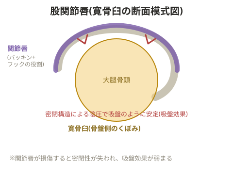

# 股関節唇損傷

## 関節唇の役割

> 💡 **用語解説: パッキンとフックの役割**
> 関節唇は、関節液が染み渡ることで滑りを良くする「パッキン」のような役割と、関節を引っかけて安定させる「フック」のような役割の両方を持つ。

> 💡 **基礎知識: 関節唇が生む「吸盤効果」による安定性**
> 関節唇は寛骨臼のふちをぐるりと囲むように付着し、関節内部を外部から密閉する働きも持つ。この密閉構造により関節内部がわずかな陰圧(周囲より低い圧力)に保たれ、大腿骨頭が寛骨臼に吸い付くような力(吸盤効果)が生まれる。これは筋肉の張力とは別に働く、いわば構造そのものが生み出す追加の安定化装置にあたる。関節唇が損傷して密閉性が失われると、この吸盤効果が弱まり、股関節はより多くを筋肉の張力だけに頼って安定させる必要が出てくるため、周囲の筋力トレーニングの重要性が一層高まる。

関節がずれた状態で回旋するような動きをすると損傷につながる。

## 見極めるポイント

- 形成不全によるものか、進行中の損傷によるものかを見極める
- どのような動作の中で症状が出たのか(例: 階段を降りた時になった場合、屈曲が大きくなりすぎていないか確認し、股関節を深く曲げすぎない降り方を習得してもらう)
- 「何かきっかけになる動作をしたか」を本人に聞き、損傷かどうかの判断材料にする

