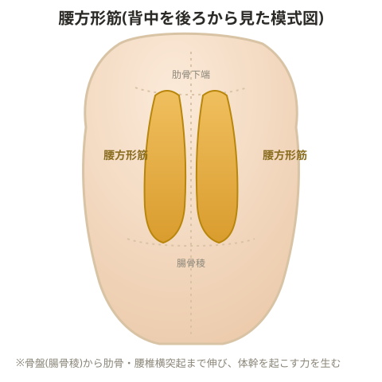

# 腰方形筋

- 脊柱起立筋は脊柱をつなげて守る役割が中心で、体を「立たせる」機能はほとんど持たない
- 骨盤から背骨を立たせる働きは、主に腰方形筋が担っている
- 腰方形筋は弱くなりやすく、疲れやすい筋肉でもある

> 💡 **基礎知識: 脊柱起立筋と腰方形筋、役割が異なる構造上の理由**
> 脊柱起立筋は椎骨から椎骨へと、比較的短い距離を何本もの線維でつなぐ構造をしており、隣り合う椎骨同士を安定させる「連結・保護」の役割に向いている。一方、腰方形筋は骨盤(腸骨稜)から肋骨・腰椎の横突起まで、比較的長い距離を1本の太い筋肉としてつないでおり、骨盤という土台から体幹を持ち上げる、てこの力を効率よく発揮しやすい構造になっている。同じ「背中の筋肉」でも付着部の距離・線維の向きが異なることで、担う役割(細かい安定化か、大きな力の発揮か)が分かれている。

## トレーニング例

> 💡 **用語解説: リバースプルオーバー**
> 腰方形筋を主導にして脊柱を起こす種目。

まずはリバースプルオーバーで腰方形筋主導の動きを覚え、その後で殿筋の動きも同時に加え、殿筋も一緒に使えるようにしていく。最初は可動域を狭くした状態で練習するとよい。

