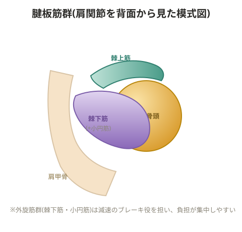

# 腱板損傷

外旋から内旋へ動きが移行する際にエネルギーをうまく逃がせないと、外旋筋群にコンセントリック(短縮性収縮)の負担が集中してしまう。

> 💡 **基礎知識: 「エネルギーを逃がす」とはどういうことか**
> 投球のように腕を大きく振る動作では、腕を後方に引く局面で外旋筋群がエキセントリック(伸びながら力を発揮する)収縮でブレーキをかけ、その減速のエネルギーを弾性エネルギーとして一部吸収してから、内旋方向への切り返しに滑らかにつなげるのが本来の効率的な動作。この減速→切り返しの流れがうまく機能しないと、外旋筋群は「エネルギーを吸収して受け流す」仕事ではなく、いきなり強い力で止めてすぐに逆方向に収縮する仕事を強いられることになり、腱板に繰り返し過大な負担がかかる。上腕肩甲リズムの乱れやフォームの崩れが腱板損傷のリスクになるのは、この本来の「受け流し」の機能を妨げてしまうため。

## 主な要因

- **肩を多く使うスポーツのオーバーユース**: 構造上の問題がなくても使いすぎで発生する。その場合は余計なことをせず、まず休ませることが対応になる
- **上腕肩甲リズムがうまく機能していないこと**が原因になる場合
- **肩を下げることを意識しすぎたフォーム**: 「肩を上げてはいけない」という思い込みからくるフォーム修正がかえって損傷を招くケースがある
- **コンタクトスポーツによるもの**: 「当たる」こと自体が直接の原因というより、日常的に軽微な骨折(微細損傷)が繰り返し起きており、それに対してカルシウムが沈着し骨の隙間(スペース)が狭くなっていることが背景にある。ラットプルダウンのような種目でも、手首を固定するアタッチメント(ケーブル+レッグ用パーツなど)を使って外旋位を保てるように工夫すると痛みが出にくい
- **杖を使う動作**: 肩関節・上腕骨が内旋位のまま下からの衝撃を受けることで損傷する。杖は外旋位で持つよう意識させる
- **柔軟性の左右アンバランス**

## 半月板損傷についてのメモ(同ページ内の記録)

上から荷重がかかった状態での下腿の回旋動作によって半月板を損傷するケースがある。体重を乗せた状態からの回旋動作が原因になりやすいため、レッグプレスなどの種目で回旋動作が入っていないか注意して観察する。

