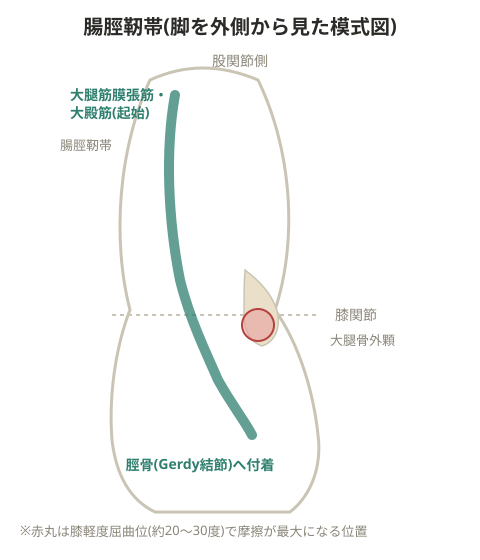

# 腸脛靭帯炎

腸脛靭帯が大腿骨外顆と擦れて炎症を起こす状態。腸脛靭帯自体が肥厚してこすれる場合もある。

> 💡 **基礎知識: なぜ膝の特定の角度で症状が出やすいのか**
> 腸脛靭帯は膝関節の外側を通り、膝の曲げ伸ばしに伴って大腿骨外顆(大腿骨の外側の出っ張り)の前後をわずかに移動する。膝が軽く曲がった角度(目安として20〜30度前後)で、腸脛靭帯がちょうどこの大腿骨外顆の真上を通過するタイミングがあり、この瞬間に靭帯と骨の間で圧迫・摩擦が最大になる。ランニングでは接地の瞬間がちょうどこの角度域に近いことが多く、走るたびにこの「擦れやすいポイント」を繰り返し通過することが炎症の蓄積につながる。

## 原因・要因

- ランニングによる大腿筋膜張筋・大殿筋のオーバーユースからの拘縮
- 内反膝や内転筋の筋力不足で大腿骨が内反し、大腿骨外顆と腸脛靭帯がこすれやすい環境になる
- 大殿筋・中殿筋(股関節外転筋)の筋力不足により、ランニング時の左右のブレを大腿筋膜張筋で支えようとして拘縮する
- 大腿筋膜張筋・大殿筋のケア不足
- 大腿骨外顆の形状には個人差があり、外側に大きく出ている人は膝関節屈曲だけでもこすれて炎症が起きやすい
- 擦れることで大腿筋膜張筋自体が肥厚することもある
- 梨状筋の拘縮により股関節外旋位で走ると腸脛靭帯が伸長された状態になり、より擦れやすくなる
- 変形性膝関節症による内反膝、大腿骨頭の形成不全、大腿骨の手術歴
- 接地が過剰に内側に入る、ニーイントゥーアウト、内反膝、回内足

> 💡 **用語解説: トレンデレンブルグ徴候**
> 中殿筋が麻痺・機能不全を起こしている際、歩行の片脚支持期に骨盤が支持脚と反対側に傾く現象。

## 対策

- 炎症を抑えるためアイシングを行う
- 股関節外転筋群(大殿筋・大腿筋膜張筋・中殿筋)のストレッチで緩める
- 内転筋のトレーニング(側臥位で下側の脚を天井方向に上げる種目など)
- 大腿筋膜張筋・大殿筋の可動域を広げる動的ストレッチ。股関節内転方向に大きく引き上げ、遠心力を使って無理のない範囲で外転させる
- 重症の場合は手術も選択肢
- 股関節内旋筋(小殿筋、長内転筋)のトレーニング、外旋六筋の静的ストレッチ、中殿筋のトレーニング
- 接地位置の修正、コアトレーニング(横ブレを抑える)

> ⚠️ 大腿骨外顆へのコンプレッション(圧迫)は禁止。摩擦が増し炎症が悪化する恐れがあるため、その部分はほぐさない。

## 備考

- 腸腰筋や中殿筋の機能が低下すると、その役割を補おうとして大腿筋膜張筋が拘縮する
- 内腹斜筋とは筋膜を介して連動している
- O脚で外側接地している場合、上記の条件が重なると特に痛みが出やすい

