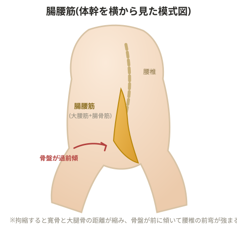

# 腸腰筋硬縮による腰痛

## メカニズム

> 💡 **用語解説: 腸腰筋**
> 大腰筋と腸骨筋を合わせた呼び名。大腰筋は寛骨内側縁から大腿骨に走行している。

腸腰筋が拘縮すると、寛骨内側縁と大腿骨の距離が近くなり、骨盤が過前傾する。すると腰椎の前弯も強まり、椎体間の椎間板後面が圧迫され、周囲の神経を刺激して腰痛につながる。悪化するとヘルニアに至ることもある。座っている時間が長い人は腸腰筋を使わず萎縮しやすく、40代に腰痛が多い一因とも考えられる。

> 💡 **基礎知識: 腰椎の前弯が強まると神経の通り道も狭くなる**
> 腰椎が過前弯になると、椎骨同士の間隔が後方で狭まるだけでなく、神経根が脊柱管から枝分かれして出ていく出口(椎間孔)も同時に狭くなりやすい。椎間板後面が圧迫されて後方に膨らむ変化が加わると、この狭くなった椎間孔の中で神経根がさらに圧迫を受けやすくなり、腰の痛みだけでなく殿部・下肢への放散痛やしびれを伴うこともある。腸腰筋の拘縮を取り除き骨盤の過前傾を改善するアプローチは、単に筋肉の柔軟性を上げるだけでなく、この神経の通り道を物理的に広げ直すことにもつながっている。

## 原因・要因の整理

**腸腰筋を使わない生活習慣による場合**
- デスクワーク中心・座位中心の生活
- スリッパで足を引きずって歩く習慣
- 階段よりエスカレーターを使うなど、足を引き上げる動作の不足
- 運動不足

**痛みによって股関節を動かせないことによる場合**
- 変形性股関節症
- 寛骨臼形成不全
- 関節軟骨の破壊
- 関節唇損傷
- 関節リウマチ など

## 改善策

骨盤が過前傾していると考えられるため、前傾させる筋群にストレッチを、後傾させる筋群にトレーニングを処方する。疾患・既往歴がある場合は、必ず医師の許可を得たうえで、慎重に低負荷から行う。

- **トレーニング**: ハムストリングス(スプリットスクワット)、大殿筋(ヒップリフト)
- **ストレッチ**: 動的ストレッチ、腸腰筋、大腿四頭筋、縫工筋、広背筋、脊柱起立筋

大殿筋の柔軟性不足も過前傾の一因になる。

## 腸腰筋硬縮の主な原因パターン

1. 短距離走・ハードルなど、瞬時に足を引き上げる動作を伴う競技では、腸腰筋の最大収縮が繰り返され拘縮が起きる
2. ハムストリングス・大殿筋など下肢の筋力不足や反り姿勢の人は、歩行・ランニング時にハムストリングスをうまく使えず、代わりに腸腰筋へ負担がかかる
3. 座位中心の生活では、背もたれと座面で体重を支えるため腸腰筋が使われず筋線維が細くなり筋力低下する。この状態では日常動作でも相対的に負荷が高くなり拘縮しやすい
4. ハムストリングスの筋力不足により、ランニング時に脚を前で「さばく」ような動きが習慣化してしまう
5. 登山など、腸腰筋を過剰に使う activities を行っている

## プログラム

**①腸腰筋の柔軟性・可動域を上げ、緊張状態から脱する**
- 静的ストレッチ: 片膝をつき、前足を90度に曲げて前に出す。後ろ足側の手を上に伸ばし前方に回旋させる
- 動的ストレッチ: 四つん這いから膝を胸に引き付け、股関節・膝関節を伸展する動作を繰り返す。ストレッチバンドを使うとより伸ばしやすい
- ⚠️ 拘縮が過剰で痛みが出ている場合はアイシングを行う

**②ハムストリングス・大殿筋のトレーニング**
腸腰筋や大腿四頭筋に頼らず推進力を生み出せるよう、レッグカール(ハムストリングス)やヒップリフト(大殿筋)を漸進的に行い、歩行時の推進力を体の背面で作れるようにする

**③脊椎のナチュラルカーブを作る**
腸腰筋硬縮による骨盤の過前傾が腰痛の原因と考えられるため、バランスボールでの動的ストレッチやストレッチポールのエクササイズで腰椎本来のカーブを作る

**④トレーニングメニューの見直し**
アスリートの場合はオーバートレーニングになっていないか確認する。一般の人でも、原因と考えられる生活動作があれば一定期間取り除く

