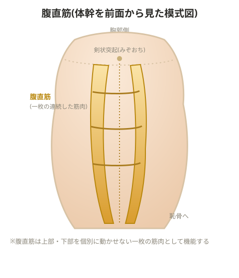

# 腹直筋

## 腹直筋機能低下の主な原因

1. **妊娠・出産後**: ほとんどの女性に腹直筋の機能低下が起こる。基本的には自然に回復するが、放置すると回復しないこともある
2. **アスリート**: 呼吸を伴う運動を続けることで腹直筋が固まり、機能低下しやすい
3. **腰痛を持つ人**: 腹圧が下がることで腹直筋の機能が低下する

## ①妊娠・出産後のケース

- 頭を下にした姿勢でエンコンパス系のマシンに寝て、ハンドルを持ち手の力を使いながら動かすトレーニングが良い。妊婦にも使え、骨盤底筋群に負担をかけずに行える
- 腹圧がかかっていない状態の方が、骨盤底筋群のトレーニングを行いやすい

## ②アスリートのケース

腹直筋が機能低下すると肋骨の動きが悪くなる。胸郭前壁を押し下げる力が強すぎて、呼吸がしづらくなっている状態。腹直筋の上部が硬くなっている可能性がある。

**呼吸が浅くなっている場合のチェック方法**
- うつ伏せの状態で胸郭がどれくらい動いているか確認する
- 腹直筋の動きが悪くなっていないか確認する
- 剣状突起(みぞおち付近の骨)の動きに注意する
- シットアップやMMT(徒手筋力検査)で機能を確認する

> 💡 腹直筋は上部・下部に分けて個別に動かすことはできない一枚の筋肉として考える。起始部の張りが強いと胸郭の膨らみが悪くなる。剣状突起を避け(肋骨が交わる位置から指2本分外した位置で)コンプレッションを行うと、腹直筋の張りによる胸郭の広がりにくさに対応できる。

## その他、腹直筋機能に関わる要因

- 帯状疱疹: 免疫力が低下している時に症状が出る免疫反応の一つ
- ポリオによる麻痺

## 機能低下時の症状

- 強制呼気が困難になり、痰が溜まりやすくなる
- バルサルバ呼吸法ができなくなる

> 💡 **用語解説: バルサルバ呼吸法**
> 息を止めて腹圧を高めながら力を発揮する呼吸法。腰椎にかかる負担を30〜50%軽減する効果があるとされる。重量挙げなど高負荷の種目でよく使われる。

> 💡 **基礎知識: 腹圧が腰椎の負担を減らす仕組み(油圧増幅効果)**
> 腹腔は横隔膜(上)・骨盤底筋群(下)・腹横筋や腹斜筋(側面)によって囲まれた、密閉できる「圧力容器」のような構造になっている。バルサルバ呼吸法でこの腹腔内の圧力を高めると、腹腔全体が内側から張った風船のように硬くなり、その硬さが脊柱を側面から支える追加のサポート材として働く(油圧増幅効果、ハイドロリック・アンプリファイア効果とも呼ばれる)。これにより、脊柱起立筋など背骨の後方の筋肉だけに頼らずに体幹を安定させられるため、椎骨・椎間板にかかる圧縮負荷が軽減される。腹直筋の機能が低下しこの腹圧をうまく作れなくなると、この「風船のサポート」が働かず、腰椎への負担がそのまま増えてしまう。

- 心肺持久力の低下
- 機能低下が進むと、代償として腰椎の伸展が起きやすくなる

## トレーニングの進め方

機能低下している場合は、まず「動かす練習」から始め、その後で徐々に負荷を加えていく。

## 胸腰筋膜の機能低下との関連(メモ)

> 💡 **用語解説: 胸腰筋膜の特殊性**
> 胸腰筋膜は他の筋膜と異なり、筋肉のような機能的な役割(腰椎を支え守る)を持つとされる。腹圧・腹直筋との関係を含めて評価する必要がある。

評価の観点: フィジカルチェック、インナーユニットのトレーニング状況、ループの確認、パワーポジションが取れているか。

- コンタクトを強くするためのトレーニングでは、大腿四頭筋とハムストリングスの筋力差が大きい選手ほど、腰椎分離症やコンタクトスポーツでの怪我が多い傾向がある

