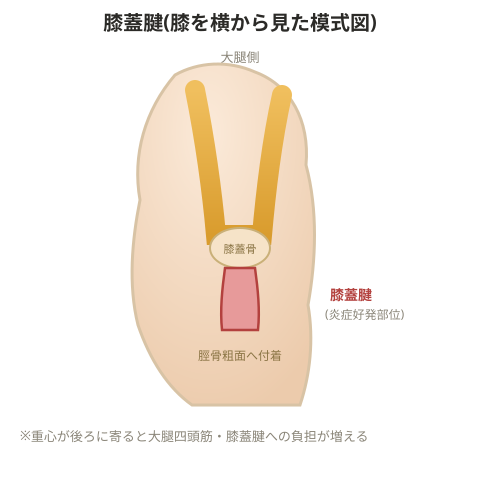

# 膝蓋腱炎

## チェック

- ワンレッグスクワットで膝が前に出る人は、ハムストリングスが弱くヒラメ筋も弱い一方で腓腹筋が強い、というパターンが原因になりやすい(殿筋で体を支えられず前に体重をかけられないため、重心が後ろに寄ってしまう)

> 💡 **基礎知識: 重心が後ろに寄ると膝蓋腱への負担が増える理由**
> スクワット動作で重心が後方に寄ると、膝関節がより深く前方に折れ曲がる代わりに、体を支えるための力の大部分を大腿四頭筋(と、それが力を伝える膝蓋腱)に頼ることになる。逆に殿筋・ハムストリングスがしっかり働き、お尻を後ろに引くようなフォーム(重心が適切な位置にある状態)であれば、支える力の一部を股関節の伸展筋群に分散できる。膝蓋腱炎の対策で殿筋・ハムストリングスの機能を重視するのは、単に大腿四頭筋を弱めるためではなく、本来分散されるべき負荷の配分を取り戻し、膝蓋腱に集中する負担を減らすことが目的になっている。
- 大腿四頭筋・ハムストリングス・腓腹筋・ヒラメ筋の柔軟性チェック、スクワット/ランジ動作の確認、動作習得ができているかを見る

> 💡 **用語解説: 腓腹筋とヒラメ筋の違い**
> 腓腹筋は膝と足首の両方をまたぐ多関節筋で、筋力を発揮するために筋腹が盛り上がって付いているため、筋周囲を測定して評価する(下腿では柔軟性に着目)。ヒラメ筋は足関節のみをまたぐ短関節筋で、主に関節の安定に関わるため、サイズでの評価優先度は低い。

## 原因

- 動作習得が不十分で重心の位置が不自然になっていることが多い
- ①大腿四頭筋の使いすぎ(ハムストリングス・ヒラメ筋が弱いことによるオーバーユース) ②大腿四頭筋の柔軟性不足(膝蓋骨が滑走しやすくなる) ③ジャンプの反復動作で腓腹筋を使いやすくなっている(ジャンプではヒラメ筋・腓腹筋の両方を使う)
- 「引っ張られる」という症状は、反対側(拮抗筋)がうまく働いていないことの表れでもあり、大腿四頭筋の柔軟性低下だけが原因とは限らない

## トレーニング

- 腓腹筋のトレーニングは避ける(NG)
- ハムストリングスとヒラメ筋のトレーニングを行う
- 大腿四頭筋は柔軟性を上げることを優先する
- 膝関節屈曲位でのトレーニング(ランジなど)を行う

> 💡 膝関節がどのように滑走しているか、どの筋肉の組み合わせで滑り出しを防いでいるかを意識して評価する。

