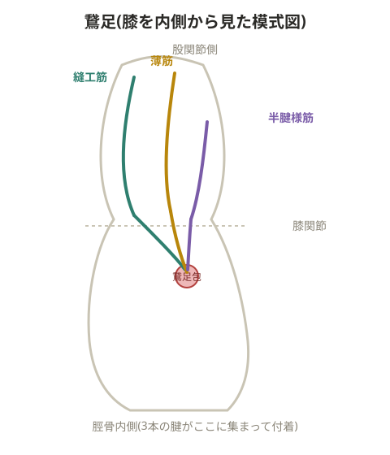

# 鵞足炎

> 💡 **用語解説: 鵞足**
> 脛骨内側の前面に縫工筋・薄筋・半腱様筋の3つの腱が集まって付着する部分。ガチョウの足に似た形状からこう呼ばれる。屈伸動作を繰り返すことで、この付着部(停止部)に張力がかかり炎症を起こす。

> 💡 **基礎知識: 鵞足炎には「腱の炎症」と「滑液包の炎症」の2種類がある**
> 鵞足を形成する3本の腱と、その下にある脛骨の骨との間には、摩擦を減らすための小さな滑液包(鵞足包)が存在する。鵞足炎と呼ばれる症状には、腱そのものの付着部に負荷がかかって起こる腱炎と、腱と骨の間で摩擦が繰り返されて滑液包に炎症が起こる滑液包炎の、2つの異なる病態が含まれていることがある。3本の腱が1点に集中して付着する構造上、繰り返しの牽引力と摩擦力の両方が集中しやすく、これが鵞足炎の再発率の高さの一因になっていると考えられる。

## 原因

- 最大の原因はハムストリングスの柔軟性低下
- 縫工筋・半腱様筋・薄筋の硬さが強いと頻発する
- 外反・外旋が加わると発症しやすく、X脚の人がなりやすい
- 大腿四頭筋が使えていない走り方の人はなりやすい(膝が不安定でハムストリングスに頼ってしまうため)
- 股関節が不安定で大腿骨が安定しないと、鵞足に負担がかかる
- 再発率が高い

## 対応

- 安静、アイシング(1日3〜4回、1回約20分)、抗炎症薬
- アーチの高いシューズに変える
- インソールの使用も有効

> 💡 **用語解説: 縫工筋・薄筋の役割**
> 縫工筋は股関節・膝関節の屈曲に加え、股関節の外転・外旋、膝関節の内旋にも関わる筋肉。薄筋は大腿内側を走る細長い筋肉で、大腿内転筋群(恥骨筋・薄筋・長内転筋・短内転筋・大内転筋)の一つ。股関節と膝関節の両方をまたぐ二関節筋で、その停止腱が鵞足を形成する。

