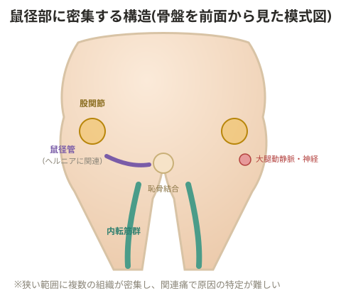

# 鼠蹊部痛

鼠蹊部(そけいぶ)の痛みは原因によって見分け方が異なる。

> 💡 **基礎知識: 鼠径部の痛みが「診断の難所」とされる理由**
> 鼠径部はごく狭い範囲に、股関節そのもの、腸腰筋・内転筋群などの筋肉、恥骨結合、鼠径ヘルニアに関わる腹壁の構造、リンパ節、大腿神経・大腿動静脈といった複数の異なる組織が密集している。これらの組織はそれぞれ独立してではなく、互いに近接し神経支配も一部重なっているため、ある組織の痛みが別の組織の痛みと似た場所・似た感覚として現れやすい(関連痛・診断の重複)。鼠径部痛の原因究明に複数の触診ポイント・動作テストを組み合わせる必要があるのは、この解剖学的な密集度の高さゆえに、単一の検査だけでは原因を一つに絞り込みにくいため。

## ①鼠径ヘルニア

外鼠径・内鼠径・大腿鼠径のポイントを押して確認する。軽度の場合は股関節を伸展させた状態で押すと、柔らかいものが飛び出てくるような感覚がある。

## ②リンパ管の炎症

リンパの張り感がある。細菌が入った場所からリンパ管に沿って腫れが広がる。

> ⚠️ 抗生物質を多量に摂取すると耐性菌の問題が生じ、免疫力が下がることがある。体脂肪率が低く集団生活をしている選手は感染リスクが上がりやすい(用具の共有など)。マメをめくる際は必ず消毒し、使用するピンセットも消毒すること。

## ③変形性股関節症

背臥位から膝関節を90度に曲げたまま股関節を屈伸させる。その際、股関節が内旋し、反対側より膝の位置が高くなる場合は変形性股関節症が疑われる。

## ④恥骨周囲炎

睾丸のすぐ裏にある左右の骨を触診する。痛みがあれば恥骨周囲炎が疑われる。

## ⑤腹直筋腱炎

まず腰方形筋に拘縮部位がないか触診する。お腹側の位置とこの拘縮部位には関連性がある。腰方形筋の張りが重度になるほど、腸腰筋→腹横筋→腹斜筋→腹直筋の順(深層から表層へ)に拘縮が広がっていく傾向がある。

